<picture>
  <source media="(prefers-color-scheme: dark)" srcset="resources/branding/doba-dark.png">
  
</picture>
<br><br>

<picture>
  <source media="(prefers-color-scheme: dark)" srcset="resources/readme/readme-hero-dark.svg">
  
</picture>
<br><br>

[](https://github.com/martianlabs/doba/actions/workflows/ci.yml?query=branch%3Amain)

**Meet doba:** a header-only C++20 server framework. Protocols and transports
mind their own business. HTTP/1.1 comes first; the architecture leaves room
for more.

**Native IOCP on Windows. Native epoll on Linux.**
The TCP transport needs no external libraries; optional TLS uses OpenSSL.

[Try the examples](examples/README.md) /
[Peek under the hood](docs/ARCHITECTURE.md)

<a name="okay-how-fast"></a>
<h2>
  <picture>
    <source media="(prefers-color-scheme: dark)" srcset="resources/readme/readme-performance-dark.svg">
    
  </picture>
</h2>

Big throughput numbers are fun. Waiting for a response isn't. Let's look at both.

Measured on **Scaleway, 2026-10-07**, using the official HttpArena suite with
**RUNS=3**. Results are selected by upstream from its repetitions, not averaged
across runs. Load generators run in Docker; this is not an exact replica of the
official host or a published HttpArena leaderboard result.

Every chart shows the **same top 10 from the overall ranking**, ordered by each
test's metric. Scores retain normalization across all **21 measured servers**.
The total includes eight scored profiles and the upstream completeness factor;
`pipelined`, `latency-500k-8cpu` and `static-tls` are reference-only profiles.

Tested revisions: HttpArena `3b2450e061c2` /
doba `0e90df945cc1`. The pipelined result describes that tested revision.
[Full results and measurement warnings](resources/benchmarks/scaleway-test-005/summary.txt) /
[Parsed data](resources/benchmarks/scaleway-test-005/data.json).

<a href="resources/benchmarks/scaleway-test-005/benchmark-overall.svg" title="Open full-size light chart">
  <picture>
    <source media="(prefers-color-scheme: dark)" srcset="resources/benchmarks/scaleway-test-005/benchmark-overall-dark.svg">
    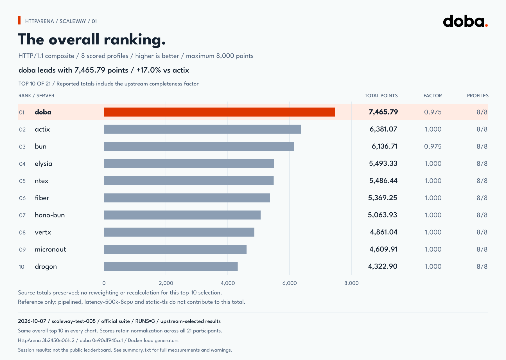
  </picture>
</a>

Full-size: [Light](resources/benchmarks/scaleway-test-005/benchmark-overall.svg) /
[Dark](resources/benchmarks/scaleway-test-005/benchmark-overall-dark.svg).
<br><br>

<a href="resources/benchmarks/scaleway-test-005/benchmark-baseline.svg" title="Open full-size light chart">
  <picture>
    <source media="(prefers-color-scheme: dark)" srcset="resources/benchmarks/scaleway-test-005/benchmark-baseline-dark.svg">
    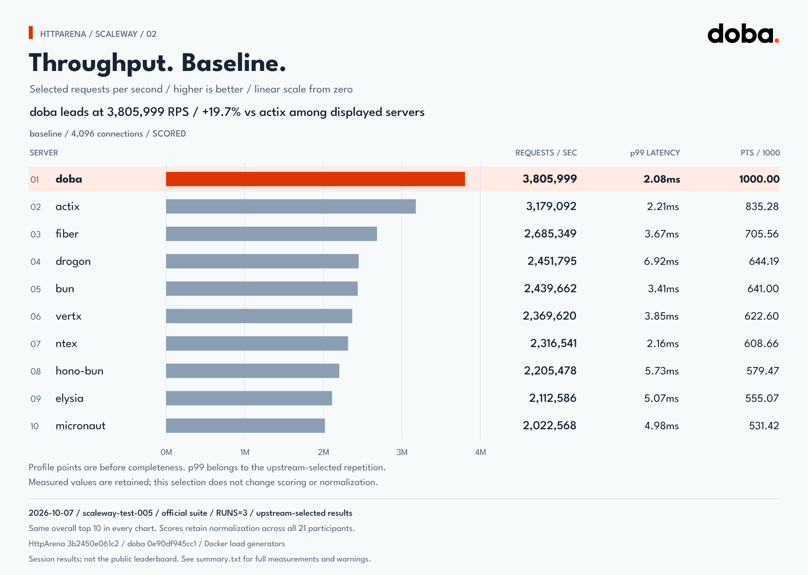
  </picture>
</a>

Full-size: [Light](resources/benchmarks/scaleway-test-005/benchmark-baseline.svg) /
[Dark](resources/benchmarks/scaleway-test-005/benchmark-baseline-dark.svg).
<br><br>

<a href="resources/benchmarks/scaleway-test-005/benchmark-pipelined.svg" title="Open full-size light chart">
  <picture>
    <source media="(prefers-color-scheme: dark)" srcset="resources/benchmarks/scaleway-test-005/benchmark-pipelined-dark.svg">
    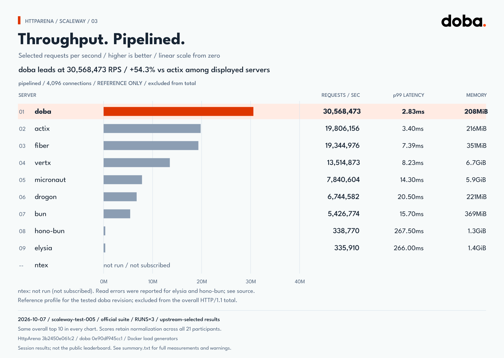
  </picture>
</a>

Full-size: [Light](resources/benchmarks/scaleway-test-005/benchmark-pipelined.svg) /
[Dark](resources/benchmarks/scaleway-test-005/benchmark-pipelined-dark.svg).
<br><br>

<a href="resources/benchmarks/scaleway-test-005/benchmark-limited-conn.svg" title="Open full-size light chart">
  <picture>
    <source media="(prefers-color-scheme: dark)" srcset="resources/benchmarks/scaleway-test-005/benchmark-limited-conn-dark.svg">
    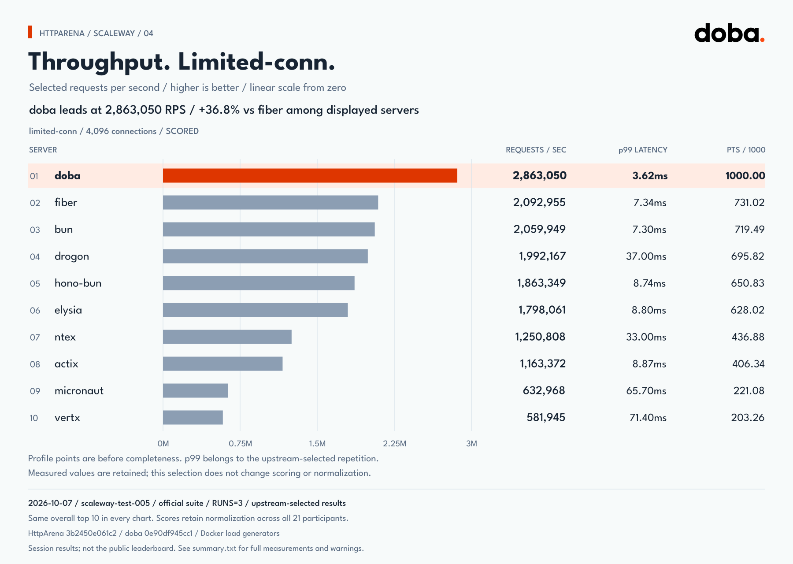
  </picture>
</a>

Full-size: [Light](resources/benchmarks/scaleway-test-005/benchmark-limited-conn.svg) /
[Dark](resources/benchmarks/scaleway-test-005/benchmark-limited-conn-dark.svg).
<br><br>

<a href="resources/benchmarks/scaleway-test-005/benchmark-latency-10k.svg" title="Open full-size light chart">
  <picture>
    <source media="(prefers-color-scheme: dark)" srcset="resources/benchmarks/scaleway-test-005/benchmark-latency-10k-dark.svg">
    
  </picture>
</a>

Full-size: [Light](resources/benchmarks/scaleway-test-005/benchmark-latency-10k.svg) /
[Dark](resources/benchmarks/scaleway-test-005/benchmark-latency-10k-dark.svg).
<br><br>

<a href="resources/benchmarks/scaleway-test-005/benchmark-latency-1m.svg" title="Open full-size light chart">
  <picture>
    <source media="(prefers-color-scheme: dark)" srcset="resources/benchmarks/scaleway-test-005/benchmark-latency-1m-dark.svg">
    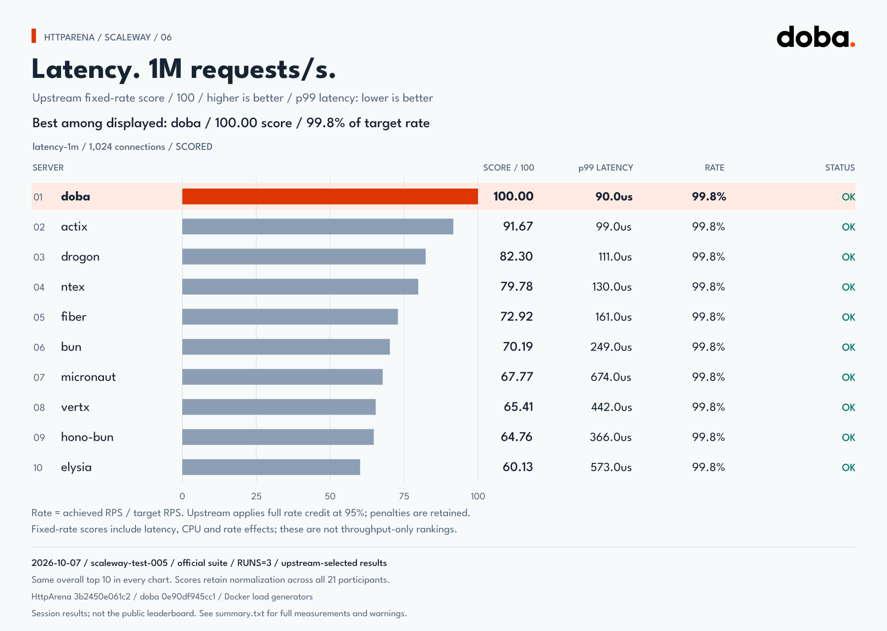
  </picture>
</a>

Full-size: [Light](resources/benchmarks/scaleway-test-005/benchmark-latency-1m.svg) /
[Dark](resources/benchmarks/scaleway-test-005/benchmark-latency-1m-dark.svg).
<br><br>

<a href="resources/benchmarks/scaleway-test-005/benchmark-latency-500k-8cpu.svg" title="Open full-size light chart">
  <picture>
    <source media="(prefers-color-scheme: dark)" srcset="resources/benchmarks/scaleway-test-005/benchmark-latency-500k-8cpu-dark.svg">
    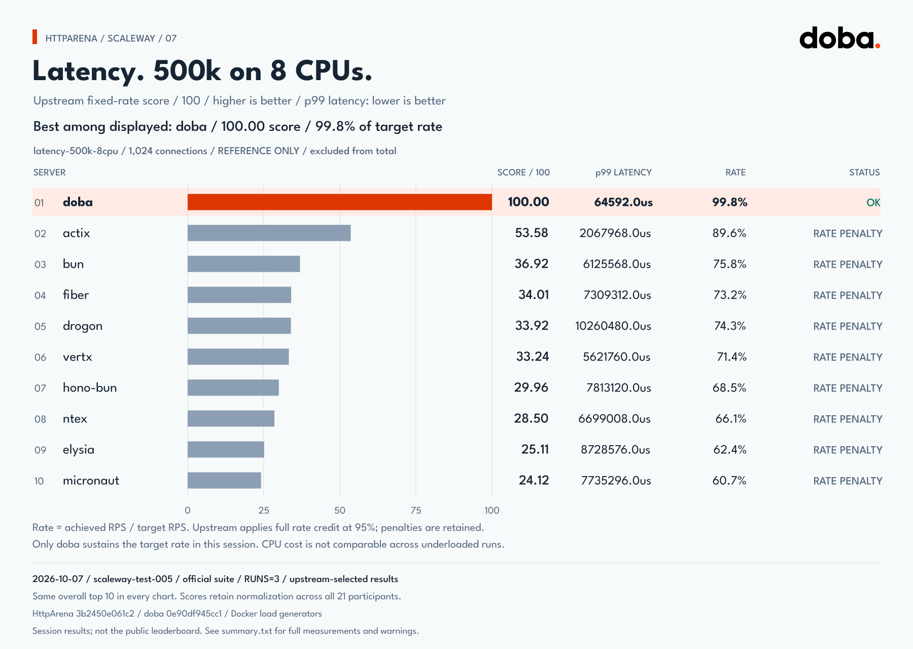
  </picture>
</a>

Full-size: [Light](resources/benchmarks/scaleway-test-005/benchmark-latency-500k-8cpu.svg) /
[Dark](resources/benchmarks/scaleway-test-005/benchmark-latency-500k-8cpu-dark.svg).
<br><br>

<a href="resources/benchmarks/scaleway-test-005/benchmark-async.svg" title="Open full-size light chart">
  <picture>
    <source media="(prefers-color-scheme: dark)" srcset="resources/benchmarks/scaleway-test-005/benchmark-async-dark.svg">
    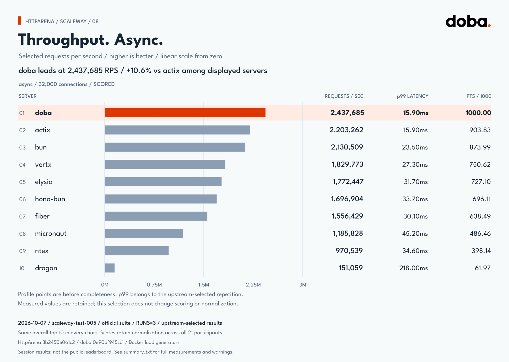
  </picture>
</a>

Full-size: [Light](resources/benchmarks/scaleway-test-005/benchmark-async.svg) /
[Dark](resources/benchmarks/scaleway-test-005/benchmark-async-dark.svg).
<br><br>

<a href="resources/benchmarks/scaleway-test-005/benchmark-json-comp.svg" title="Open full-size light chart">
  <picture>
    <source media="(prefers-color-scheme: dark)" srcset="resources/benchmarks/scaleway-test-005/benchmark-json-comp-dark.svg">
    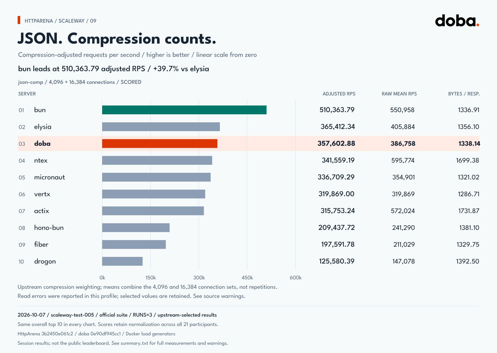
  </picture>
</a>

Full-size: [Light](resources/benchmarks/scaleway-test-005/benchmark-json-comp.svg) /
[Dark](resources/benchmarks/scaleway-test-005/benchmark-json-comp-dark.svg).
<br><br>

<a href="resources/benchmarks/scaleway-test-005/benchmark-json-tls.svg" title="Open full-size light chart">
  <picture>
    <source media="(prefers-color-scheme: dark)" srcset="resources/benchmarks/scaleway-test-005/benchmark-json-tls-dark.svg">
    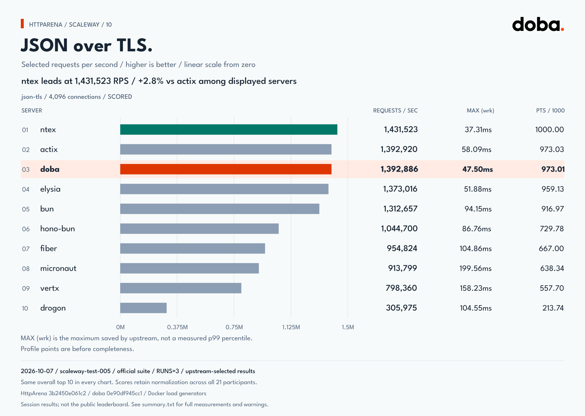
  </picture>
</a>

Full-size: [Light](resources/benchmarks/scaleway-test-005/benchmark-json-tls.svg) /
[Dark](resources/benchmarks/scaleway-test-005/benchmark-json-tls-dark.svg).
<br><br>

<a href="resources/benchmarks/scaleway-test-005/benchmark-8gbit.svg" title="Open full-size light chart">
  <picture>
    <source media="(prefers-color-scheme: dark)" srcset="resources/benchmarks/scaleway-test-005/benchmark-8gbit-dark.svg">
    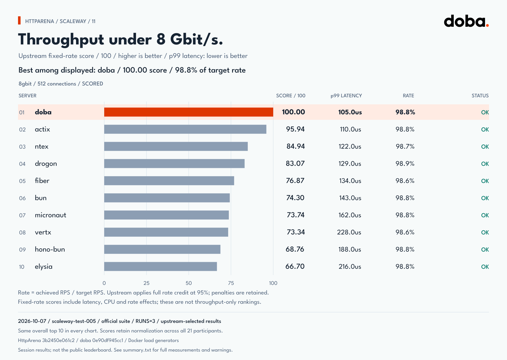
  </picture>
</a>

Full-size: [Light](resources/benchmarks/scaleway-test-005/benchmark-8gbit.svg) /
[Dark](resources/benchmarks/scaleway-test-005/benchmark-8gbit-dark.svg).
<br><br>

<a href="resources/benchmarks/scaleway-test-005/benchmark-static-tls.svg" title="Open full-size light chart">
  <picture>
    <source media="(prefers-color-scheme: dark)" srcset="resources/benchmarks/scaleway-test-005/benchmark-static-tls-dark.svg">
    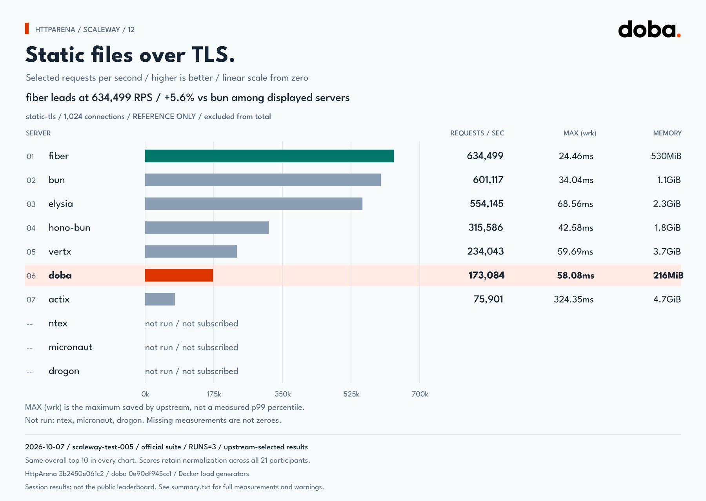
  </picture>
</a>

Full-size: [Light](resources/benchmarks/scaleway-test-005/benchmark-static-tls.svg) /
[Dark](resources/benchmarks/scaleway-test-005/benchmark-static-tls-dark.svg).
<br><br>

<a name="no-magic-a-few-deliberate-choices"></a>
<h2>
  <picture>
    <source media="(prefers-color-scheme: dark)" srcset="resources/readme/readme-design-dark.svg">
    
  </picture>
</h2>

*A few deliberate choices.*

- **HTTP does HTTP. I/O does I/O.** Protocols handle message rules; transports
  move bytes. The same HTTP implementation runs on both native backends.

- **Copies should earn their keep.** Metadata views, explicit ownership, and
  a fixed buffer for small responses help avoid unnecessary copies.
  Not "zero-copy everything". Just deliberate data movement.

- **Handlers run directly.** Synchronous execution preserves request order
  without a separate response scheduler.

<a name="hello-world-lets-not-overcomplicate-it"></a>
<h2>
  <picture>
    <source media="(prefers-color-scheme: dark)" srcset="resources/readme/readme-hello-dark.svg">
    
  </picture>
</h2>

*Let's not overcomplicate it.*

```cpp
#include "common/signaler.h"
#include "protocol/http/v11/server.h"

using namespace martianlabs::doba::common;
using namespace martianlabs::doba::protocol::http::v11;

int main() {
  server srv({.ip = "0.0.0.0", .port = "8080"});
  srv.add_route(
      "GET", "/hello",
      [](const request&, response& res) {
        res.ok_200();
        res.add_header("Content-Type", "text/plain")
            .set_body("hello from doba");
      });
  srv.start();
  signaler::wait();
}
```

Once running: `curl http://localhost:8080/hello`

[Build & integrate](docs/DEVELOPMENT.md)

<details>
<summary>Build, install, and use with CMake</summary>

With a C++20 compiler and CMake 3.20 or later, build the bundled examples and
tests, then install the headers and package configuration:

```sh
cmake -S . -B out/build/release -DCMAKE_BUILD_TYPE=Release
cmake --build out/build/release --config Release
cmake --install out/build/release --config Release --prefix out/install/release
```

In your application:

```cmake
find_package(doba CONFIG REQUIRED)
target_link_libraries(application PRIVATE martianlabs::doba)
```

For TLS, configure with `-DDOBA_ENABLE_TLS=ON` and link
`martianlabs::doba_tls`. OpenSSL is required for this optional transport.
See the [HTTPS example](examples/http/v11/https_hello_world/README.md).

Set `CMAKE_PREFIX_PATH` to the installation prefix when it is not in a
standard system location. The exported target provides the include directory,
C++20 requirement, and system threading dependency.

For compiler setup, presets, build options, and test commands, see
[Development](docs/DEVELOPMENT.md).

</details>

<a name="fast-is-nice-correct-is-non-negotiable"></a>
<h2>
  <picture>
    <source media="(prefers-color-scheme: dark)" srcset="resources/readme/readme-correctness-dark.svg">
    
  </picture>
</h2>

*Correct is non-negotiable.*

We like fast code. We also like sleeping at night. HTTP/1.1 parsing and framing
follow RFC rules; CI checks GCC, Clang, and MSVC builds, strict warnings, and
ASan, UBSan, and TSan runs.

**We're working toward 0.1.** TLS is available as an optional transport;
compression and operational hardening are still in progress.
Here's [what's left to do](docs/BACKLOG.md).

---

Bring a compiler. Curiosity helps.

[Quality rules](docs/QUALITY.md) / [Apache 2.0](LICENSE)

