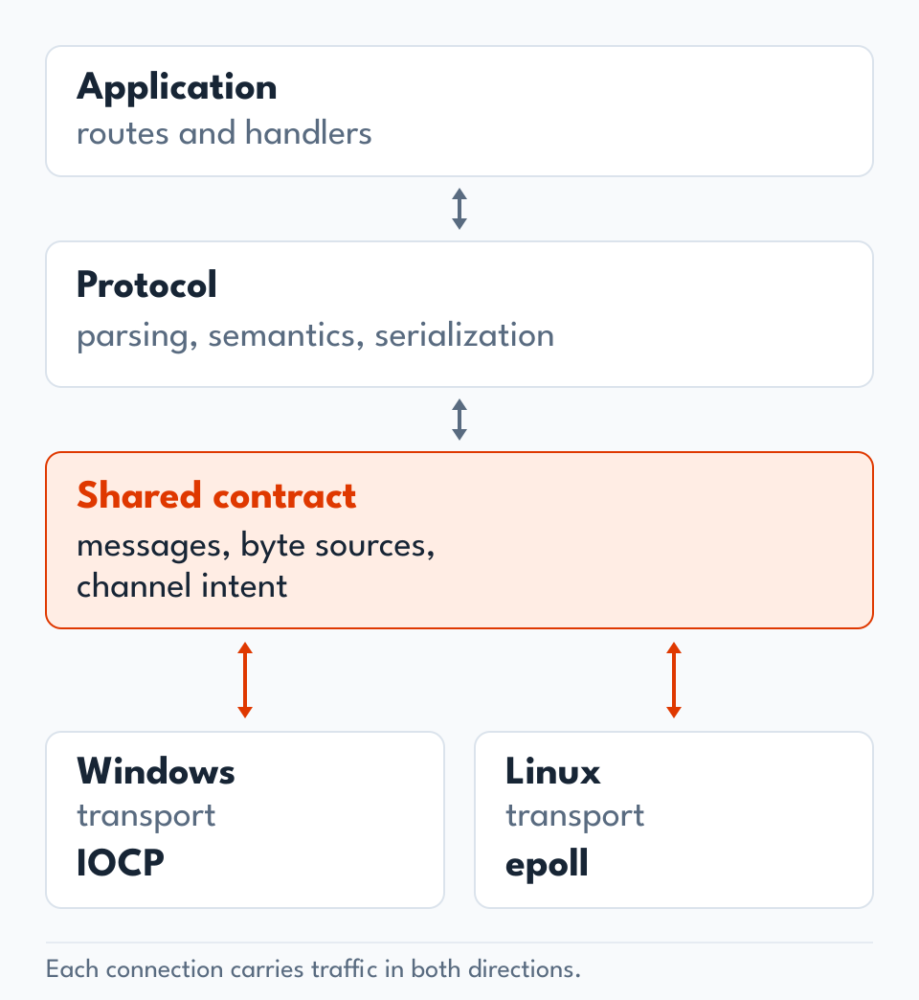

<a name="architecture"></a>
<h1>
  <picture>
    <source media="(prefers-color-scheme: dark)" srcset="../resources/docs/architecture/h1-architecture-dark.svg">
    
  </picture>
</h1>

[Index](HANDOFF.md)

**Protocol independence. Native I/O. Deliberate memory use.**

Doba is a C++20 header-only server framework built around a small boundary:
protocols understand messages; transports move bytes. Application code sits
above that boundary, while platform-specific I/O remains below it.

<a name="separate-meaning-from-movement"></a>
<h2>
  <picture>
    <source media="(prefers-color-scheme: dark) and (max-width: 640px)" srcset="../resources/docs/architecture/h2-separate-meaning-from-movement-narrow-dark.svg">
    <source media="(max-width: 640px)" srcset="../resources/docs/architecture/h2-separate-meaning-from-movement-narrow.svg">
    <source media="(prefers-color-scheme: dark)" srcset="../resources/docs/architecture/h2-separate-meaning-from-movement-dark.svg">
    
  </picture>
</h2>

<a href="../resources/docs/architecture/diagram-protocol-transport.svg" title="Open full-size light diagram">
  <picture>
    <source media="(prefers-color-scheme: dark)" srcset="../resources/docs/architecture/diagram-protocol-transport-dark.svg">
    
  </picture>
</a>

Full-size: [Light](../resources/docs/architecture/diagram-protocol-transport.svg) /
[Dark](../resources/docs/architecture/diagram-protocol-transport-dark.svg).

A transport never interprets HTTP methods, headers, or status codes.
The protocol decides what a message means and whether its channel should
remain open or close. The transport handles sockets, scheduling, byte
delivery, and connection lifetime.

The shared contract carries decoded requests, progress or rejection results,
opaque rejection reasons, serialized bytes, and optional body readers.
Even interim responses cross this boundary as bytes.

This keeps protocol rules in one place and lets the same HTTP implementation
run on both native backends. A different protocol can use the same transport
contract without teaching IOCP or epoll its message semantics.

<a name="compose-with-types"></a>
<h2>
  <picture>
    <source media="(prefers-color-scheme: dark) and (max-width: 640px)" srcset="../resources/docs/architecture/h2-compose-with-types-narrow-dark.svg">
    <source media="(max-width: 640px)" srcset="../resources/docs/architecture/h2-compose-with-types-narrow.svg">
    <source media="(prefers-color-scheme: dark)" srcset="../resources/docs/architecture/h2-compose-with-types-dark.svg">
    
  </picture>
</h2>

The server composes its request, response, decoder, transport, and router
through C++ template parameters. Platform selection happens at compile time.
This makes the selected implementations visible to the compiler and allows
concrete calls to be optimized where their definitions are available.

The HTTP layer combines decoding, routing, and response rules. The transport
depends on the generic contract. Neither needs a parallel implementation of
the other's responsibilities.

<a name="make-every-copy-serve-a-purpose"></a>
<h2>
  <picture>
    <source media="(prefers-color-scheme: dark) and (max-width: 640px)" srcset="../resources/docs/architecture/h2-make-every-copy-serve-a-purpose-narrow-dark.svg">
    <source media="(max-width: 640px)" srcset="../resources/docs/architecture/h2-make-every-copy-serve-a-purpose-narrow.svg">
    <source media="(prefers-color-scheme: dark)" srcset="../resources/docs/architecture/h2-make-every-copy-serve-a-purpose-dark.svg">
    
  </picture>
</h2>

Memory layout and ownership shape the request path:

| Stage | Design choice | Purpose |
| --- | --- | --- |
| Decode | A contiguous accumulation buffer and views into field data. | Parse without allocating a string for every field. |
| Own the request | Copy the head into request-owned storage and rebase its views. | Keep metadata valid when the decoder reuses its buffer. |
| Read metadata | Expose `string_view` and header views. | Access stored data without producing owning copies. |
| Build a response | Keep headers and small bodies together in a fixed buffer. | Handle small responses without a separate body store. |
| Transfer a large body | Move a reader into the serialization result. | Let the transport drain it without flattening it into one large string. |

Copies remain at receive, ownership, and send boundaries. The goal is to
avoid redundant materialization while keeping lifetimes explicit.

RAII owns buffers and temporary storage. Readers and writers are move-only;
borrowed views require their backing storage to remain alive. Shared
ownership is used where a request or connection must survive deferred work
or an outstanding I/O operation.

For absolute-form HTTP/1.1 requests, the target authority is effective
even when Host differs ([RFC 9112 S3.2.2](https://www.rfc-editor.org/rfc/rfc9112.html#section-3.2.2)).
`get_host()` and its port/type getters expose the received Host;
`get_target_authority_host()` and its port/type getters expose the target
authority. The raw Host header remains available. Host syntax and
multiplicity checks and CONNECT/authority-form behavior are preserved.

The decoder rejects more than 128 non-empty query pairs before mounting a
request. Empty pairs between '&' separators do not count. It also rejects
an incomplete head immediately when its 5120-byte buffer fills. Complete
heads of exactly that size remain accepted, and bodies can span multiple
buffers. Both capacity failures return `kInvalidSource` with the existing
generic reason, which the standard server maps to 400 Bad Request.
These internal capacities are distinct from configurable resource policies
and transport inactivity timeouts.

<a name="keep-the-common-path-direct"></a>
<h2>
  <picture>
    <source media="(prefers-color-scheme: dark) and (max-width: 640px)" srcset="../resources/docs/architecture/h2-keep-the-common-path-direct-narrow-dark.svg">
    <source media="(max-width: 640px)" srcset="../resources/docs/architecture/h2-keep-the-common-path-direct-narrow.svg">
    <source media="(prefers-color-scheme: dark)" srcset="../resources/docs/architecture/h2-keep-the-common-path-direct-dark.svg">
    
  </picture>
</h2>

Synchronous handlers run directly and return a move-only response by value:
`response(const request&, ...)`. Deferred handlers retain
`task<response>(shared_ptr<const request>, stop_token, ...)`, keeping the
request alive and receiving a cancellation token.

Both shapes support const and mutable call operators, with or without
`noexcept`. The qualifiers do not relax request, return, cancellation or
routing-parameter checks. The async concept identifies a task-returning
shape; registration validates its exact request, cancellation and result types.

The server-to-transport callback returns `variant<Response, task<Response>>`.
Error callbacks also return a response by value. The transport serializes
each immediate or completed response before enqueuing its owned prefix and
optional body reader.

A deferred response reserves its position in the connection's response order.
Completion can happen out of order; transmission follows the reserved order.
This keeps pipelining correct without forcing every handler through the
deferred execution path.

Protocol processing also has explicit stages: syntax checks, semantic rules,
body framing, and payload reading. Incoming chunked data is validated as it
arrives and decoded when the application reads the stored body.

<a name="own-controller-instances"></a>
<h2>
  <picture>
    <source media="(prefers-color-scheme: dark) and (max-width: 640px)" srcset="../resources/docs/architecture/h2-own-controller-instances-narrow-dark.svg">
    <source media="(max-width: 640px)" srcset="../resources/docs/architecture/h2-own-controller-instances-narrow.svg">
    <source media="(prefers-color-scheme: dark)" srcset="../resources/docs/architecture/h2-own-controller-instances-dark.svg">
    
  </picture>
</h2>

`server.add_controller<Type>(args...)` constructs one instance and invokes its
`register_routes(registrar&)` once. The registrar binds member function pointers
to the existing route handlers, preserving typed arguments, async handlers, and
route precedence. It is only valid during that registration call.

All routes of a registration share their controller. Deferred invocations keep
it alive until completion; `stop()` preserves registered instances, and
cancellation does not destroy suspended user work. Controllers must synchronize
their own mutable state because multiple requests can enter them concurrently.

Registration is transactional: any exception removes the routes added by that
call. An empty controller registration is rejected. Registration through the
server is disabled while running. Controllers need no base class, reflection,
or copy/move support. See the [controller example](../examples/http/v11/controllers).

<a name="use-each-platforms-native-execution-model"></a>
<h2>
  <picture>
    <source media="(prefers-color-scheme: dark) and (max-width: 640px)" srcset="../resources/docs/architecture/h2-use-each-platforms-native-execution-model-narrow-dark.svg">
    <source media="(max-width: 640px)" srcset="../resources/docs/architecture/h2-use-each-platforms-native-execution-model-narrow.svg">
    <source media="(prefers-color-scheme: dark)" srcset="../resources/docs/architecture/h2-use-each-platforms-native-execution-model-dark.svg">
    
  </picture>
</h2>

Windows uses IOCP and overlapped I/O. Connection ownership survives pending
operations, and sending state is synchronized.

Linux uses epoll workers with their own listeners and accepted connections.
Socket and epoll operations for a connection remain on its owning worker.
This keeps mutable connection state close to the work that consumes it.

Both backends obey the same ordering, cancellation, and lifecycle contracts.
Graceful closure drains responses that are safe to send; fatal failure stops
transmission when continuing would corrupt the stream.

<a name="construct-and-transfer-responses"></a>
<h2>
  <picture>
    <source media="(prefers-color-scheme: dark) and (max-width: 640px)" srcset="../resources/docs/architecture/h2-construct-and-transfer-responses-narrow-dark.svg">
    <source media="(max-width: 640px)" srcset="../resources/docs/architecture/h2-construct-and-transfer-responses-narrow.svg">
    <source media="(prefers-color-scheme: dark)" srcset="../resources/docs/architecture/h2-construct-and-transfer-responses-dark.svg">
    
  </picture>
</h2>

Create each response through its status factory, for example:

```cpp
auto res = response::ok_200();
res.set_body("ok");
return res;
```

The constructor that allocates storage is private. Status factories write
the status line and establish the header offset before any fields are added.
The buffer has fixed capacity and is allocated without zero initialization.
Move construction and move assignment remain public and noexcept.
To replace a status, assign a fresh response, such as
`res = response::not_found_404()`. This discards the previous fields and body.
Synchronous parametrized invocation throws when extraction or conversion
fails, matching the asynchronous adapter; it never returns an uninitialized
response or invokes the handler on invalid parameters.

Serialization consumes the response. The returned serialization_result owns
`prefix` as a unique_ptr<char[]> and bounds its initialized bytes with
`prefix_size`. A zero length may use a null pointer. Any body reader is owned
by the result as before. After serialization or moving from a response, only
destroy it or assign another response before using it again.

The status line and headers are already in their final positions. Serialization
adds the terminating CRLF, compacts any inline body with memmove (the regions
may overlap), and transfers the buffer. It does not copy the header block into
a separate string. Both transports still copy these bytes into their send
buffers at the existing point in the queue; serialization timing is unchanged.
Existing HTTP field, framing and body-suppression rules remain unchanged.

<a name="control-data-movement-as-bodies-grow"></a>
<h2>
  <picture>
    <source media="(prefers-color-scheme: dark) and (max-width: 640px)" srcset="../resources/docs/architecture/h2-control-data-movement-as-bodies-grow-narrow-dark.svg">
    <source media="(max-width: 640px)" srcset="../resources/docs/architecture/h2-control-data-movement-as-bodies-grow-narrow.svg">
    <source media="(prefers-color-scheme: dark)" srcset="../resources/docs/architecture/h2-control-data-movement-as-bodies-grow-dark.svg">
    
  </picture>
</h2>

Body storage starts in memory and can spill to a temporary file. Serialization
transfers an owned prefix and an optional body reader to the transport.
The transport drains that reader in bounded chunks and pauses refilling when
its send-buffer budget is reached.

This separates body storage from network delivery and avoids requiring one
large contiguous output allocation. Writer-backed body production completes
before the response is handed off.

`response.set_body(common::reader&& source, size_t length)` instead transfers
an existing source at its current cursor. The caller must supply its exact
remaining length. Replacing or clearing the body closes the previous source.
Serialization moves it into the existing transport contract, while HEAD and
bodyless statuses suppress it under the existing HTTP rules.

`common/filesystem.h` provides `filesystem_root` and the move-only
`filesystem_file`. The common header uses `std::filesystem` for paths and
configuration, with native opening and reading isolated in `filesystem_linux.h`
and `filesystem_windows.h`. Open calls reject symbolic links and reparse points;
Windows also checks the final handle's resolved path to prevent concurrent
attribute changes from escaping the root. The open file supplies its own size.
Moving it into a `reader` transfers its cursor and resource ownership.

`static_file_server(prefix, root)` uses this source for GET and supplies the
same size without reading contents for HEAD
([RFC 9110 S9.3.2](https://www.rfc-editor.org/rfc/rfc9110.html#section-9.3.2)).
There is no whole-file buffer or temporary-file copy. The transport reads in
bounded chunks as send capacity becomes available. These disk reads are
synchronous, so slow storage can block a worker.

Each request opens the file again, with no application cache or validators.
The initial size bounds each response; growth is ignored and premature EOF
aborts transmission before any successor response. Concurrent writes can change
the bytes: an owned handle is not an immutable content snapshot.

Paths are taken from the already decoded request, with no second decoding
([RFC 3986 S2.4](https://www.rfc-editor.org/rfc/rfc3986.html#section-2.4)).
The configured root is resolved once; subsequent opens reject links even if
the root's path has been replaced. Only regular files are served, with no
automatic index or directory listing. Windows device names and alternate
streams are rejected.

This version does not serve ranges; ignoring Range is permitted by
[RFC 9110 S14.2](https://www.rfc-editor.org/rfc/rfc9110.html#section-14.2).
Without entity tags, explicit If-Match cannot match. Existence-based `*`
conditions still apply, in If-Match then If-None-Match order
([RFC 9110 S13.2.2](https://www.rfc-editor.org/rfc/rfc9110.html#section-13.2.2)).
Caching, modification-date validators, compression, and asynchronous disk
reads are deferred. See the [filesystem](../examples/common/filesystem) and
[static file server](../examples/http/v11/static_file_server) examples.

<a name="keep-the-design-measurable"></a>
<h2>
  <picture>
    <source media="(prefers-color-scheme: dark) and (max-width: 640px)" srcset="../resources/docs/architecture/h2-keep-the-design-measurable-narrow-dark.svg">
    <source media="(max-width: 640px)" srcset="../resources/docs/architecture/h2-keep-the-design-measurable-narrow.svg">
    <source media="(prefers-color-scheme: dark)" srcset="../resources/docs/architecture/h2-keep-the-design-measurable-dark.svg">
    
  </picture>
</h2>

A new abstraction must earn its cost. Favor direct control flow, explicit
ownership, and fewer allocations or copies where measurements justify them.
Preserve protocol correctness before pursuing throughput.

[Quality rules](QUALITY.md) define the validation required for changes.
[Examples](../examples/README.md) show the public API.
[Backlog](BACKLOG.md) defines outstanding capabilities and release scope.
