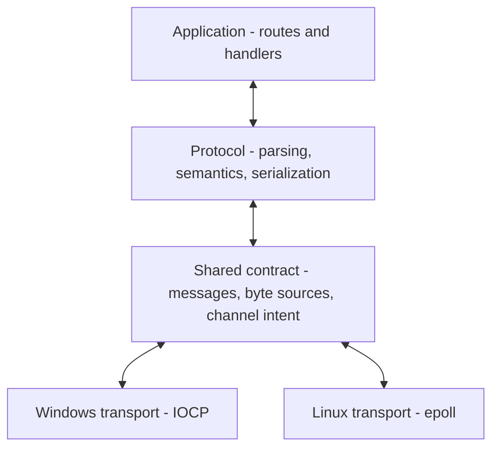

# Architecture

[Index](HANDOFF.md)

**Protocol independence. Native I/O. Deliberate memory use.**

Doba is a C++20 header-only server framework built around a small boundary:
protocols understand messages; transports move bytes. Application code sits
above that boundary, while platform-specific I/O remains below it.

## Separate meaning from movement

A transport never interprets HTTP methods, headers, or status codes.
The protocol decides what a message means and whether its channel should
remain open or close. The transport handles sockets, scheduling, byte
delivery, and connection lifetime.

The shared contract carries decoded requests, progress or rejection results,
opaque rejection reasons, serialized bytes, and optional body readers.
Even interim responses cross this boundary as bytes.

This keeps protocol rules in one place and lets the same HTTP implementation
run on both native backends. A different protocol can use the same transport
contract without teaching IOCP or epoll its message semantics.

## Compose with types

The server composes its request, response, decoder, transport, and router
through C++ template parameters. Platform selection happens at compile time.
This makes the selected implementations visible to the compiler and allows
concrete calls to be optimized where their definitions are available.

The HTTP layer combines decoding, routing, and response rules. The transport
depends on the generic contract. Neither needs a parallel implementation of
the other's responsibilities.

## Make every copy serve a purpose

Memory layout and ownership shape the request path:

| Stage | Design choice | Purpose |
| --- | --- | --- |
| Decode | A contiguous accumulation buffer and views into field data. | Parse without allocating a string for every field. |
| Own the request | Copy the head into request-owned storage and rebase its views. | Keep metadata valid when the decoder reuses its buffer. |
| Read metadata | Expose `string_view` and header views. | Access stored data without producing owning copies. |
| Build a response | Keep headers and small bodies together in a fixed buffer. | Handle small responses without a separate body store. |
| Transfer a large body | Move a reader into the serialization result. | Let the transport drain it without flattening it into one large string. |

Copies remain at receive, ownership, and send boundaries. The goal is to
avoid redundant materialization while keeping lifetimes explicit.

RAII owns buffers and temporary storage. Readers and writers are move-only;
borrowed views require their backing storage to remain alive. Shared
ownership is used where a request or connection must survive deferred work
or an outstanding I/O operation.

## Keep the common path direct

Synchronous handlers run directly and produce a response without requiring a
coroutine task. Deferred handlers use C++20 coroutines, retain the request
for their lifetime, and receive a cancellation token.

A deferred response reserves its position in the connection's response order.
Completion can happen out of order; transmission follows the reserved order.
This keeps pipelining correct without forcing every handler through the
deferred execution path.

Protocol processing also has explicit stages: syntax checks, semantic rules,
body framing, and payload reading. Incoming chunked data is validated as it
arrives and decoded when the application reads the stored body.

## Use each platform's native execution model

Windows uses IOCP and overlapped I/O. Connection ownership survives pending
operations, and sending state is synchronized.

Linux uses epoll workers with their own listeners and accepted connections.
Socket and epoll operations for a connection remain on its owning worker.
This keeps mutable connection state close to the work that consumes it.

Both backends obey the same ordering, cancellation, and lifecycle contracts.
Graceful closure drains responses that are safe to send; fatal failure stops
transmission when continuing would corrupt the stream.

## Control data movement as bodies grow

Body storage starts in memory and can spill to a temporary file. Serialization
transfers an owned prefix and an optional body reader to the transport.
The transport drains that reader in bounded chunks and pauses refilling when
its send-buffer budget is reached.

This separates body storage from network delivery and avoids requiring one
large contiguous output allocation. Body production currently completes
before the response is handed off; draining a stored body is distinct from
progressive application streaming.

## Keep the design measurable

A new abstraction must earn its cost. Favor direct control flow, explicit
ownership, and fewer allocations or copies where measurements justify them.
Preserve protocol correctness before pursuing throughput.

[Quality rules](QUALITY.md) define the validation required for changes.
[Examples](../examples/README.md) show the public API.
[Backlog](BACKLOG.md) defines outstanding capabilities and release scope.
