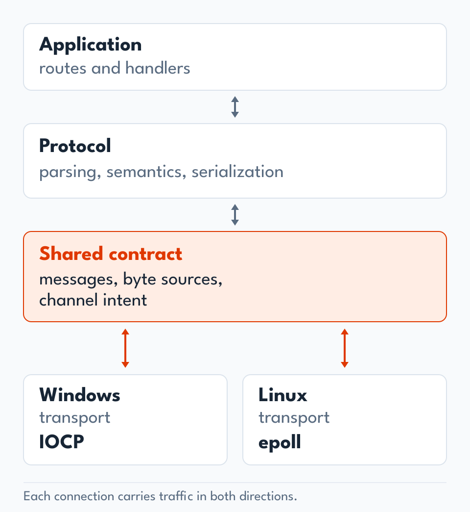

<h1>
  <picture>
    <source media="(prefers-color-scheme: dark)" srcset="../resources/docs/architecture/h1-architecture-dark.svg">
    
  </picture>
</h1>

[Index](HANDOFF.md)

**Independent protocols and transports. Native I/O. Safe ownership.**

Doba is a C++20 header-only server framework. Protocols interpret messages;
transports move bytes and manage connections. Their shared contracts keep
these responsibilities separate.

<h2>
  <picture>
    <source media="(prefers-color-scheme: dark) and (max-width: 640px)" srcset="../resources/docs/architecture/h2-separate-meaning-from-movement-narrow-dark.svg">
    <source media="(max-width: 640px)" srcset="../resources/docs/architecture/h2-separate-meaning-from-movement-narrow.svg">
    <source media="(prefers-color-scheme: dark)" srcset="../resources/docs/architecture/h2-separate-meaning-from-movement-dark.svg">
    
  </picture>
</h2>

<picture>
  <source media="(prefers-color-scheme: dark)" srcset="../resources/docs/architecture/diagram-protocol-transport-dark.svg">
  
</picture>

A protocol handles message rules without depending on a particular transport.
A transport handles network I/O without interpreting protocol messages. They
interact through contracts rather than concrete implementations.

These compile-time contracts make both sides open to extension: a new protocol
can use an existing transport, and a new transport can host an existing
protocol. The [custom protocol](../examples/protocol/custom_protocol) and
[custom transport](../examples/transport/server/custom_transport) examples
show each path.

<h2>
  <picture>
    <source media="(prefers-color-scheme: dark) and (max-width: 640px)" srcset="../resources/docs/architecture/h2-make-every-copy-serve-a-purpose-narrow-dark.svg">
    <source media="(max-width: 640px)" srcset="../resources/docs/architecture/h2-make-every-copy-serve-a-purpose-narrow.svg">
    <source media="(prefers-color-scheme: dark)" srcset="../resources/docs/architecture/h2-make-every-copy-serve-a-purpose-dark.svg">
    
  </picture>
</h2>

Reusable buffers, views into owned storage, and move-only body readers avoid
unnecessary allocations and copies. Ownership transfers are explicit, and
borrowed views remain valid only while their backing storage is available.

Runtime safety is non-negotiable: buffer limits, valid lifetimes, and
synchronized access to shared state take precedence over throughput.

<h2>
  <picture>
    <source media="(prefers-color-scheme: dark) and (max-width: 640px)" srcset="../resources/docs/architecture/h2-use-each-platforms-native-execution-model-narrow-dark.svg">
    <source media="(max-width: 640px)" srcset="../resources/docs/architecture/h2-use-each-platforms-native-execution-model-narrow.svg">
    <source media="(prefers-color-scheme: dark)" srcset="../resources/docs/architecture/h2-use-each-platforms-native-execution-model-dark.svg">
    
  </picture>
</h2>

Windows uses IOCP with overlapped I/O. Linux uses epoll workers. Both native
backends process connections efficiently while keeping connection state and
pending output under explicit ownership.
