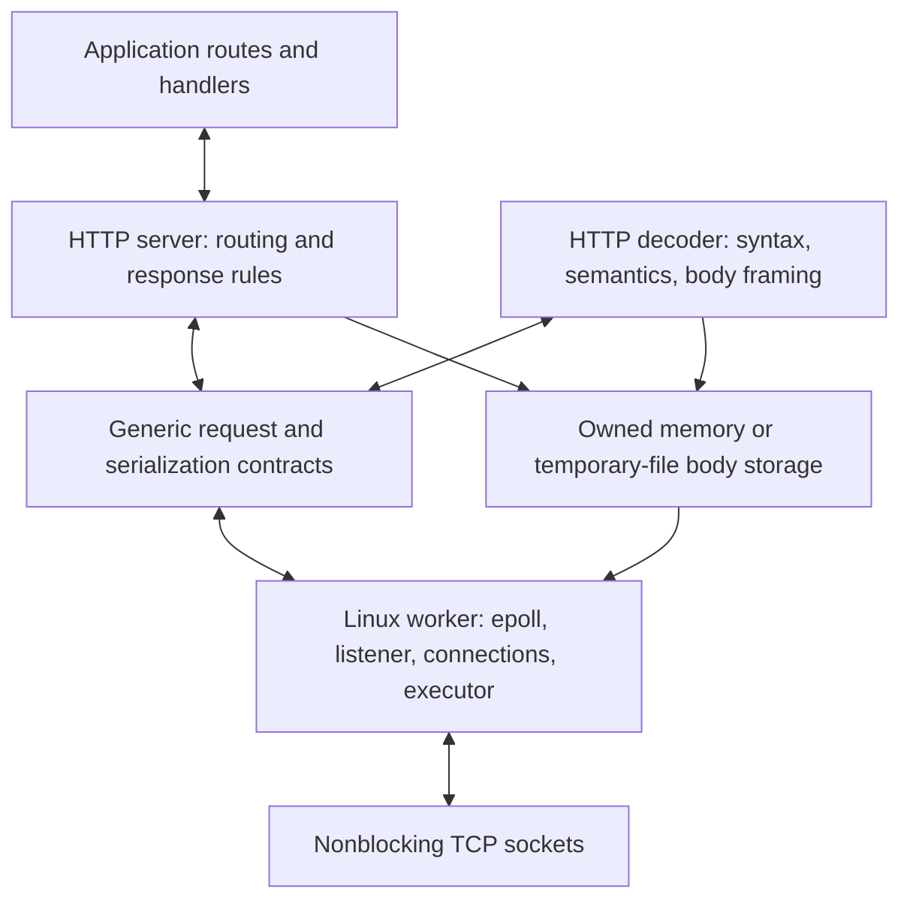

<a name="linux-epoll-and-http11-implementation-specification"></a>
<h1>
  <picture>
    <source media="(prefers-color-scheme: dark) and (max-width: 640px)" srcset="../resources/docs/linux-http11-implementation-spec/h1-linux-epoll-and-http11-implementation-specification-narrow-dark.svg">
    <source media="(max-width: 640px)" srcset="../resources/docs/linux-http11-implementation-spec/h1-linux-epoll-and-http11-implementation-specification-narrow.svg">
    <source media="(prefers-color-scheme: dark)" srcset="../resources/docs/linux-http11-implementation-spec/h1-linux-epoll-and-http11-implementation-specification-dark.svg">
    
  </picture>
</h1>

Architecture, design, implementation, API, and acceptance criteria for a
Linux-only server with behavior and performance characteristics comparable
to the reference design.

<a name="1-purpose-baseline-and-interpretation"></a>
<h2>
  <picture>
    <source media="(prefers-color-scheme: dark) and (max-width: 640px)" srcset="../resources/docs/linux-http11-implementation-spec/h2-1-purpose-baseline-and-interpretation-narrow-dark.svg">
    <source media="(max-width: 640px)" srcset="../resources/docs/linux-http11-implementation-spec/h2-1-purpose-baseline-and-interpretation-narrow.svg">
    <source media="(prefers-color-scheme: dark)" srcset="../resources/docs/linux-http11-implementation-spec/h2-1-purpose-baseline-and-interpretation-dark.svg">
    
  </picture>
</h2>

This document is a handoff to an implementation agent. Build a C++20,
header-only HTTP/1.1 server using Linux TCP sockets and epoll. Preserve the
application API, message handling, ownership, response ordering, and direct
synchronous execution described here. Windows and IOCP are outside the port.

The design snapshot was inspected on 2026-09-07. No test suite or benchmark
was executed to produce this document: descriptions of existing tests mean
inspected test coverage, not a fresh successful run.

The implementation descriptions below are derived from inspected source.
The algorithms, contracts, API tables, examples, and acceptance scenarios
allow implementation to start with this document alone. File paths describe
the component layout to reproduce. Examples use the neutral root namespace
`net`; public names below that root retain the specified API contract.
Standard field grammars are identified explicitly rather than embedding
entire RFCs.

Three distinctions apply throughout:

- **Baseline behavior** describes what the inspected implementation does.
- **Port requirement** identifies behavior needed for the equivalent port.
- **Limitation or extension** identifies an existing boundary or work that
  has not been implemented. Do not advertise it as a baseline capability.

Do not equate API compatibility with ABI compatibility. Preserve the documented
namespace structure, include paths, public signatures, overloads, return semantics, and handler
behavior. Private implementation details may be Linux-specific. Keep a
record of intentional observable differences, especially when correcting a
baseline limitation. Undefined behavior is not a compatibility requirement.

There is no established numeric throughput target in this snapshot. High
performance here means reproducing the mechanisms and then demonstrating
comparable throughput, latency, memory use, and scaling under identical
conditions. A minimal benchmark endpoint alone is insufficient.

<a name="reading-order"></a>
<h3>
  <picture>
    <source media="(prefers-color-scheme: dark)" srcset="../resources/docs/linux-http11-implementation-spec/h3-reading-order-dark.svg">
    
  </picture>
</h3>

1. Sections 2-3: composition and protocol/transport contracts.
2. Sections 4-8: complete Linux execution and performance design.
3. Sections 9-12: HTTP decoding, fields, body storage, and serialization.
4. Sections 13-14: public API and application examples.
5. Sections 15-18: limits, acceptance, implementation sequence, measurements.

<a name="2-architectural-composition"></a>
<h2>
  <picture>
    <source media="(prefers-color-scheme: dark) and (max-width: 640px)" srcset="../resources/docs/linux-http11-implementation-spec/h2-2-architectural-composition-narrow-dark.svg">
    <source media="(max-width: 640px)" srcset="../resources/docs/linux-http11-implementation-spec/h2-2-architectural-composition-narrow.svg">
    <source media="(prefers-color-scheme: dark)" srcset="../resources/docs/linux-http11-implementation-spec/h2-2-architectural-composition-dark.svg">
    
  </picture>
</h2>



HTTP decides methods, target forms, header rules, status codes, framing,
and channel intent. The transport accepts connections, moves sized byte
ranges, invokes callbacks, orders output, and closes sockets. It never
parses a response header to discover whether the connection should close.

The server composes these types at compile time:

```cpp
template <typename RQty = request, typename RSty = response,
          template <typename, typename> class DEty = decoder,
          template <typename, typename,
                    template <typename, typename> typename> class TRty =
              transport::server::tcpip,
          template <typename, typename> class ROty = router>
class server;
```

Preserve this composition point if source compatibility includes custom
decoders, responses, transports, or routers. The default port needs only the
Linux implementation behind `transport/server/tcpip.h`. It does not need a
new platform interface or a Windows-shaped abstraction.

| Component | Responsibility and main source |
| --- | --- |
| HTTP server | Route dispatch, automatic replies, final response rules: `include/protocol/http/v11/server.h`. |
| HTTP decoder | Accumulation, request head, field dispatch, body boundaries: `include/protocol/http/v11/decoder.h`. |
| HTTP values | Owned request metadata and response construction: `include/protocol/http/v11/request.h`, `include/protocol/http/v11/response.h`. |
| Router | Static, typed parameter, wildcard, sync/async matching: `include/protocol/http/common/router.h`. |
| TCP implementation | Worker, connection context, socket lifecycle, output queue: `include/transport/server/tcpip_linux.h`. |
| Async support | Lazy tasks, detached completion, owner-worker scheduling: `include/common/task.h`, `include/transport/server/tcpip.h`, `include/transport/server/executor.h`. |
| Body storage | Move-only storage, memory-to-file spill, readers/writers: `include/common/byte_storage.h`. |
| HTTP framing | Raw and chunked framers, readers, writers: `include/protocol/http/v11/body`. |
| Date | Shared, periodically refreshed HTTP date: `include/common/date_server.h`. |

The baseline uses templates together with `std::function`, containers, and
selective shared ownership. It is not an entirely inlined, allocation-free,
or lock-free implementation.

<a name="3-protocoltransport-boundary"></a>
<h2>
  <picture>
    <source media="(prefers-color-scheme: dark) and (max-width: 640px)" srcset="../resources/docs/linux-http11-implementation-spec/h2-3-protocoltransport-boundary-narrow-dark.svg">
    <source media="(max-width: 640px)" srcset="../resources/docs/linux-http11-implementation-spec/h2-3-protocoltransport-boundary-narrow.svg">
    <source media="(prefers-color-scheme: dark)" srcset="../resources/docs/linux-http11-implementation-spec/h2-3-protocoltransport-boundary-dark.svg">
    
  </picture>
</h2>

<a name="31-input-contract"></a>
<h3>
  <picture>
    <source media="(prefers-color-scheme: dark)" srcset="../resources/docs/linux-http11-implementation-spec/h3-31-input-contract-dark.svg">
    
  </picture>
</h3>

The decoder exposes:

```cpp
std::size_t accumulate(char* const buffer, std::size_t size);
deserialization_result<RQty> deserialize();
```

`accumulate` copies at most the available capacity and returns the exact
accepted count. A short acceptance is normal. A zero acceptance requires
trying to consume already buffered requests before retrying. No caller may
discard the unaccepted suffix of a receive.

The neutral result has these fields:

```cpp
enum class deserialization_status {
  kSucceeded, kInvalidSource, kMoreBytesNeeded
};
enum class channel_intent { kKeep, kClose, kUpgrade };

template <typename RQty>
struct deserialization_result {
  deserialization_status code = deserialization_status::kInvalidSource;
  std::shared_ptr<RQty> request = nullptr;
  channel_intent channel = channel_intent::kKeep;
  int reason = 0;
  std::string_view interim;
};
```

This is a field sketch. The baseline also provides default/status/request
constructors and default copy/move operations. A request constructor sets
`kSucceeded`; a status constructor accepts an optional reason integer.

| Result | Transport action |
| --- | --- |
| More bytes, empty interim | Stop decoding until more input is available. |
| More bytes, nonempty interim | Copy the opaque bytes into an ordinary ordered output entry, then wait for input. |
| Success with request | Invoke the request callback exactly once; continue draining buffered complete requests. |
| Success without request | Treat as decoder failure; enqueue an error and close. |
| Invalid source | Ask the protocol callback to construct an error; stop receiving and drain safely queued output. |
| `kClose` on success | Stop accepting subsequent requests on that connection; drain the accepted response sequence. |

The HTTP decoder never emits `kUpgrade`. The enum is not proof that a
working protocol-switch mechanism exists.

Interim storage must remain valid until the transport copies it. HTTP uses
a static string for `HTTP/1.1 100 Continue\r\n\r\n`. Transport code must not
interpret or specially bypass the output queue for this string.

<a name="32-handler-callbacks"></a>
<h3>
  <picture>
    <source media="(prefers-color-scheme: dark) and (max-width: 640px)" srcset="../resources/docs/linux-http11-implementation-spec/h3-32-handler-callbacks-narrow-dark.svg">
    <source media="(max-width: 640px)" srcset="../resources/docs/linux-http11-implementation-spec/h3-32-handler-callbacks-narrow.svg">
    <source media="(prefers-color-scheme: dark)" srcset="../resources/docs/linux-http11-implementation-spec/h3-32-handler-callbacks-dark.svg">
    
  </picture>
</h3>

```cpp
using request_callback = std::function<std::optional<common::task<RSty>>(
    const std::shared_ptr<RQty>&, RSty&, const std::stop_token&)>;
using rejection_callback =
    std::function<void(int, std::string_view, RSty&)>;
using lifecycle_callback = std::function<void()>;
```

Returning `std::nullopt` means that the supplied response contains the
synchronous result. Returning a task means that the task will produce the
response; the immediate response is not serialized. The rejection integer
is opaque to the transport. The baseline reserves integer 7 for handler
errors and lets the HTTP callback translate it to status 500.

<a name="33-output-contract"></a>
<h3>
  <picture>
    <source media="(prefers-color-scheme: dark) and (max-width: 640px)" srcset="../resources/docs/linux-http11-implementation-spec/h3-33-output-contract-narrow-dark.svg">
    <source media="(max-width: 640px)" srcset="../resources/docs/linux-http11-implementation-spec/h3-33-output-contract-narrow.svg">
    <source media="(prefers-color-scheme: dark)" srcset="../resources/docs/linux-http11-implementation-spec/h3-33-output-contract-dark.svg">
    
  </picture>
</h3>

```cpp
struct serialization_result {
  std::string prefix;
  std::optional<common::reader> source;
};
```

`response.serialize()` returns
`std::unique_ptr<protocol::serialization_result>`. A null result is failure.
The prefix owns materialized bytes: normally status, headers, and an inline
body. The optional reader supplies all remaining wire bytes. A chunked
response's reader already contains chunk syntax. The transport does not
add chunk framing, infer Content-Length, or reinterpret reader output.

The transport takes exclusive ownership of the result. The source must
remain readable until exhausted or abandoned. A borrowed reader is legal
only if its backing storage outlives the entire asynchronous send.

A source read is synchronous. Zero bytes without a failure is treated by
this transport as source completion. There is no "temporarily unavailable"
source state; an asynchronous producer cannot use zero as a pause signal.

Sources: `include/protocol/deserialization.h`,
`include/protocol/serialization.h`,
`include/transport/server/tcpip.h`.

<a name="4-linux-workers-and-socket-lifecycle"></a>
<h2>
  <picture>
    <source media="(prefers-color-scheme: dark) and (max-width: 640px)" srcset="../resources/docs/linux-http11-implementation-spec/h2-4-linux-workers-and-socket-lifecycle-narrow-dark.svg">
    <source media="(max-width: 640px)" srcset="../resources/docs/linux-http11-implementation-spec/h2-4-linux-workers-and-socket-lifecycle-narrow.svg">
    <source media="(prefers-color-scheme: dark)" srcset="../resources/docs/linux-http11-implementation-spec/h2-4-linux-workers-and-socket-lifecycle-dark.svg">
    
  </picture>
</h2>

<a name="41-worker-topology-and-startup"></a>
<h3>
  <picture>
    <source media="(prefers-color-scheme: dark) and (max-width: 640px)" srcset="../resources/docs/linux-http11-implementation-spec/h3-41-worker-topology-and-startup-narrow-dark.svg">
    <source media="(max-width: 640px)" srcset="../resources/docs/linux-http11-implementation-spec/h3-41-worker-topology-and-startup-narrow.svg">
    <source media="(prefers-color-scheme: dark)" srcset="../resources/docs/linux-http11-implementation-spec/h3-41-worker-topology-and-startup-dark.svg">
    
  </picture>
</h3>

The number of workers is `max(1, std::thread::hardware_concurrency())`.
Every worker owns:

- One `std::jthread`, one epoll descriptor, one listener, one eventfd.
- One continuation dispatcher and its executor queue.
- A map from stable context pointers to owning `shared_ptr<context>`.
- An intrusive list of contexts retired during the current epoll batch.

For each worker, setup performs the following operations before any worker
thread starts:

1. `epoll_create1(EPOLL_CLOEXEC)`.
2. `eventfd(0, EFD_NONBLOCK | EFD_CLOEXEC)` and dispatcher construction.
3. `socket(AF_INET, SOCK_STREAM | SOCK_NONBLOCK | SOCK_CLOEXEC, IPPROTO_TCP)`.
4. Set `SO_REUSEADDR` and `SO_REUSEPORT` before binding.
5. Bind `INADDR_ANY` and the requested port; `listen(..., SOMAXCONN)`.
6. Add eventfd with `EPOLLIN`; add listener with `EPOLLIN | EPOLLET`.
7. Once all worker setups succeed, start all worker threads.

The public port argument must be a fully consumed decimal integer from 1
through 65535. Null, empty, signed/whitespace-padded, overflowing, partially
parsed, and zero values are rejected. Startup failure unwinds already
created workers and descriptors; a later start must remain possible.

The kernel distributes incoming TCP connections among the reuseport
listeners. Established connections remain with the accepting worker; there
is no request-by-request redistribution, work stealing, CPU affinity, or
NUMA policy. A single busy persistent connection therefore uses one worker.
There is no worker-count setting in the default public API.

`SO_REUSEPORT` enables multiple bound listeners and supports distribution of
TCP accepts; it does not promise equal application work per worker.
[Linux socket manual](https://man7.org/linux/man-pages/man7/socket.7.html).

The baseline listener is IPv4. Parsing an IPv6 Host or CONNECT authority is
an HTTP capability and does not imply an IPv6 listening socket.

<a name="42-accept-loop"></a>
<h3>
  <picture>
    <source media="(prefers-color-scheme: dark)" srcset="../resources/docs/linux-http11-implementation-spec/h3-42-accept-loop-dark.svg">
    
  </picture>
</h3>

On a listener event, repeatedly call
`accept4(..., SOCK_NONBLOCK | SOCK_CLOEXEC)` until it would block or another
non-retried error occurs. Retry `EINTR`, `ECONNABORTED`, `EPROTO`,
`ENETDOWN`, `ENOPROTOOPT`, `EHOSTDOWN`, `ENONET`, `EHOSTUNREACH`,
`EOPNOTSUPP`, and `ENETUNREACH`. Stop accepting when stopping is requested.

For each accepted socket:

1. Enable `TCP_NODELAY`; close it if this fails.
2. Allocate its context and insert the shared owner into the worker map.
3. Register `EPOLLIN | EPOLLRDHUP | EPOLLET` with `event.data.ptr = context`.
4. Invoke the connection callback. Mark the context connected only after
   the callback succeeds.

Failure cleans up the accepted socket and any registered context. No
disconnection notification is owed for a connection whose admission
callback did not successfully complete.

`TCP_NODELAY` avoids Nagle-related delay for small writes. Application-level
batching is still useful and is explicitly implemented below. The baseline
does not set `TCP_CORK`, `MSG_MORE`, custom TCP buffer sizes, reuseport BPF,
or busy-poll options. Do not attribute their effects to the reference design.

<a name="43-event-loop-and-reclamation"></a>
<h3>
  <picture>
    <source media="(prefers-color-scheme: dark) and (max-width: 640px)" srcset="../resources/docs/linux-http11-implementation-spec/h3-43-event-loop-and-reclamation-narrow-dark.svg">
    <source media="(max-width: 640px)" srcset="../resources/docs/linux-http11-implementation-spec/h3-43-event-loop-and-reclamation-narrow.svg">
    <source media="(prefers-color-scheme: dark)" srcset="../resources/docs/linux-http11-implementation-spec/h3-43-event-loop-and-reclamation-dark.svg">
    
  </picture>
</h3>

The worker calls `epoll_wait` with a stack array of 64 events and an infinite
timeout. It retries an interrupted wait. Wake events use data identifier 0;
listener events use `UINT64_MAX`; other entries carry context pointers.

```text
while running:
    events = epoll_wait(maxevents=64, timeout=-1)
    if interrupted: retry
    if other wait error: leave loop
    for event in returned batch:
        if wake: process continuation batch / stopping
        else if listener and not stopping: accept available connections
        else if context socket is still live:
            try: process connection event
            catch: abort that connection
        if stopping: break
    erase all contexts retired during this batch
    if stopping: break
```

Connection state and its decoder, response deque, send buffer, offsets, and
epoll mask belong to the owner worker while it runs. Other threads post
continuations; they do not call `send`, `recv`, `epoll_ctl`, or mutate these
fields during that period. After joining the worker, the controlling thread
has exclusive access for final context/descriptor cleanup.

Closing first marks `socket = -1`, removes it from epoll, closes the fd, and
links the context into the retirement list. The map still owns the context
until the current event batch ends. This is essential: an event already
returned by epoll can still contain its pointer. Immediate destruction or
reuse at closure can turn a later event in the batch into a dangling pointer.

Disconnection notification is guarded by connected/disconnected flags and
is emitted at most once, after socket retirement. Exceptions from that
callback are contained. Erasing the final shared owner destroys the context
and requests cooperative cancellation through its stop source.

<a name="5-receive-processing-and-pipelining"></a>
<h2>
  <picture>
    <source media="(prefers-color-scheme: dark) and (max-width: 640px)" srcset="../resources/docs/linux-http11-implementation-spec/h2-5-receive-processing-and-pipelining-narrow-dark.svg">
    <source media="(max-width: 640px)" srcset="../resources/docs/linux-http11-implementation-spec/h2-5-receive-processing-and-pipelining-narrow.svg">
    <source media="(prefers-color-scheme: dark)" srcset="../resources/docs/linux-http11-implementation-spec/h2-5-receive-processing-and-pipelining-dark.svg">
    
  </picture>
</h2>

<a name="51-readiness-is-not-message-completion"></a>
<h3>
  <picture>
    <source media="(prefers-color-scheme: dark) and (max-width: 640px)" srcset="../resources/docs/linux-http11-implementation-spec/h3-51-readiness-is-not-message-completion-narrow-dark.svg">
    <source media="(max-width: 640px)" srcset="../resources/docs/linux-http11-implementation-spec/h3-51-readiness-is-not-message-completion-narrow.svg">
    <source media="(prefers-color-scheme: dark)" srcset="../resources/docs/linux-http11-implementation-spec/h3-51-readiness-is-not-message-completion-dark.svg">
    
  </picture>
</h3>

One readiness event can represent a partial request, multiple requests, a
body plus the next request, or a half-close. One `recv` need not consume all
available input. Every receive uses the context's 8192-byte buffer and
`MSG_DONTWAIT` on a nonblocking socket.

```text
handle_connection(event):
    if EPOLLERR: abort and return
    if EPOLLIN or EPOLLRDHUP or EPOLLHUP:
        while connection accepts input:
            n = recv(buffer, 8192, MSG_DONTWAIT)
            if n > 0: consume all n bytes through decoder; continue
            if n == 0: close_input(); break
            if EINTR: continue
            if EAGAIN or EWOULDBLOCK: break
            abort and return
    if socket is closed: return
    if flushing output fails: abort and return
    update interest mask, or close if finished
```

Edge-triggered operation requires preserving progress and draining a ready
nonblocking stream until it would block. Returning early with unread data
and waiting for another edge can stall a connection.
[Linux epoll manual](https://man7.org/linux/man-pages/man7/epoll.7.html).

<a name="52-accumulation-loop"></a>
<h3>
  <picture>
    <source media="(prefers-color-scheme: dark) and (max-width: 640px)" srcset="../resources/docs/linux-http11-implementation-spec/h3-52-accumulation-loop-narrow-dark.svg">
    <source media="(max-width: 640px)" srcset="../resources/docs/linux-http11-implementation-spec/h3-52-accumulation-loop-narrow.svg">
    <source media="(prefers-color-scheme: dark)" srcset="../resources/docs/linux-http11-implementation-spec/h3-52-accumulation-loop-dark.svg">
    
  </picture>
</h3>

The receive buffer is larger than the HTTP decoder buffer. This deliberately
requires support for partial decoder acceptance:

```text
consumed = 0
do:
    accepted = decoder.accumulate(received + consumed, n - consumed)
    if accepted == 0:
        drain_decoded_requests()
        if input is closing: return
        accepted = decoder.accumulate(received + consumed, n - consumed)
    if accepted == 0 or accepted > n - consumed:
        enqueue protocol error; mark closing; return
    drain_decoded_requests()
    consumed += accepted
while input is open and consumed < n
```

`drain_decoded_requests` loops until more bytes are required, input is
rejected, or channel closure is requested. The decoder retains the suffix
after every completed request. Never assume one decoder invocation per
receive, discard a suffix, or wait for another socket event while a complete
request is already buffered.

<a name="53-synchronous-pipeline-path"></a>
<h3>
  <picture>
    <source media="(prefers-color-scheme: dark) and (max-width: 640px)" srcset="../resources/docs/linux-http11-implementation-spec/h3-53-synchronous-pipeline-path-narrow-dark.svg">
    <source media="(max-width: 640px)" srcset="../resources/docs/linux-http11-implementation-spec/h3-53-synchronous-pipeline-path-narrow.svg">
    <source media="(prefers-color-scheme: dark)" srcset="../resources/docs/linux-http11-implementation-spec/h3-53-synchronous-pipeline-path-dark.svg">
    
  </picture>
</h3>

For a batch containing Q1, Q2, and Q3:

1. Decode Q1, construct its owned request, invoke its handler inline, and
   serialize R1 into an output entry.
2. Repeat for Q2 and Q3, including any body framing each requires.
3. Continue receiving until input would block or closes.
4. Fill the send buffer from the ready response sequence and attempt send.

No coroutine, executor enqueue, or eventfd wake is required by a synchronous
handler. Several small responses can enter one `send` call because flushing
happens after the receive-draining phase. There is no deliberate batching
timer; if just one response is ready, it is sent immediately at that point.

Pipelining is a protocol property supported by the decoder and transport
together. It does not mean concurrent writes or interleaved HTTP response
bodies. Ordered responses are the relevant protocol constraint.
[RFC 9112 S9.3.2](https://www.rfc-editor.org/rfc/rfc9112.html#section-9.3.2).

<a name="54-deferred-and-mixed-pipelines"></a>
<h3>
  <picture>
    <source media="(prefers-color-scheme: dark) and (max-width: 640px)" srcset="../resources/docs/linux-http11-implementation-spec/h3-54-deferred-and-mixed-pipelines-narrow-dark.svg">
    <source media="(max-width: 640px)" srcset="../resources/docs/linux-http11-implementation-spec/h3-54-deferred-and-mixed-pipelines-narrow.svg">
    <source media="(prefers-color-scheme: dark)" srcset="../resources/docs/linux-http11-implementation-spec/h3-54-deferred-and-mixed-pipelines-dark.svg">
    
  </picture>
</h3>

The output deque contains `response_data` entries:

```cpp
struct response_data {
  std::unique_ptr<protocol::serialization_result> response;
  std::size_t state = 0;
};
```

| Entry state | Meaning |
| --- | --- |
| Non-null response, state 0 | Prefix has not been appended to the send buffer. |
| Non-null response, state 1 | Prefix appended; drain optional source next. |
| Null response, state >= 2 | Reserved position for a deferred response. |

Before scheduling a deferred operation, append a null entry with a fresh
response ID. The counter skips 0 and 1, including on wrap. Completion finds
the matching pending ID by a linear scan, installs the serialized result,
and resets state to 0. It never appends a completed response to the tail in
completion order.

```text
Accepted:      Q1 async, Q2 sync, Q3 async
Initial queue: [pending 2] [R2 ready] [pending 3]
Q3 completes:  [pending 2] [R2 ready] [R3 ready]
Wire:          empty
Q1 completes:  [R1 ready] [R2 ready] [R3 ready]
Wire:          R1, then R2, then R3
```

Only the front of the deque may feed the send buffer. A pending front is a
barrier even if later responses are ready. Finish all source bytes for R1
before appending R2's prefix. Never place R2's status line inside R1's body.

This creates head-of-line blocking within a connection. It is intentional
for ordered HTTP/1.1 output. Completion lookup is O(number of queued
entries), so deep asynchronous pipelines have an additional CPU cost.
There is no configured limit on pending tasks or output entries.

<a name="55-interim-responses-errors-and-termination-barriers"></a>
<h3>
  <picture>
    <source media="(prefers-color-scheme: dark) and (max-width: 640px)" srcset="../resources/docs/linux-http11-implementation-spec/h3-55-interim-responses-errors-and-termination-barriers-narrow-dark.svg">
    <source media="(max-width: 640px)" srcset="../resources/docs/linux-http11-implementation-spec/h3-55-interim-responses-errors-and-termination-barriers-narrow.svg">
    <source media="(prefers-color-scheme: dark)" srcset="../resources/docs/linux-http11-implementation-spec/h3-55-interim-responses-errors-and-termination-barriers-dark.svg">
    
  </picture>
</h3>

`100 Continue` is another ordered serialized prefix. If Q1 is deferred and
Q2 is waiting for permission to send its body, Q2's interim sits after Q1's
reserved response. It must not jump ahead merely because it is small.

A syntax rejection after valid Q1/Q2 appends an error after their responses
and stops input. If constructing that error fails, safe earlier responses
can still drain. A fatal body-source read failure aborts the stream and
discards unsent output because emitting a later response after an incomplete
body would corrupt framing.

If Q2 requests channel closure, Q3 must not be dispatched even if all its
bytes arrived in the same `recv`. The queued Q2 response, including any
deferred completion, retains its position until it can drain. Closure is
not an instruction to truncate that accepted response.

Ordering guarantees concern wire output. Deferred handlers may have
overlapping application side effects; ordered output does not serialize
their external effects or establish safe concurrency for non-idempotent
business operations. The application owns that coordination.

<a name="6-output-batching-partial-writes-and-readiness"></a>
<h2>
  <picture>
    <source media="(prefers-color-scheme: dark) and (max-width: 640px)" srcset="../resources/docs/linux-http11-implementation-spec/h2-6-output-batching-partial-writes-and-readiness-narrow-dark.svg">
    <source media="(max-width: 640px)" srcset="../resources/docs/linux-http11-implementation-spec/h2-6-output-batching-partial-writes-and-readiness-narrow.svg">
    <source media="(prefers-color-scheme: dark)" srcset="../resources/docs/linux-http11-implementation-spec/h2-6-output-batching-partial-writes-and-readiness-dark.svg">
    
  </picture>
</h2>

<a name="61-actual-buffer-policy"></a>
<h3>
  <picture>
    <source media="(prefers-color-scheme: dark) and (max-width: 640px)" srcset="../resources/docs/linux-http11-implementation-spec/h3-61-actual-buffer-policy-narrow-dark.svg">
    <source media="(max-width: 640px)" srcset="../resources/docs/linux-http11-implementation-spec/h3-61-actual-buffer-policy-narrow.svg">
    <source media="(prefers-color-scheme: dark)" srcset="../resources/docs/linux-http11-implementation-spec/h3-61-actual-buffer-policy-dark.svg">
    
  </picture>
</h3>

Each connection owns a reusable `std::string sending_buffer`, a byte offset
into it, and the ordered response deque. The current constants are:

| Constant | Bytes | Purpose |
| --- | ---: | --- |
| Receive buffer | 8192 | One socket receive. |
| Send refill budget | 65536 | Stop taking more queued output when the buffer reaches this size. |
| Body source read chunk | 8192 | Maximum temporary chunk copied from a reader per refill iteration. |

The 65536 value is a **refill threshold, not an absolute allocation limit**.
A ready prefix is appended whole when the buffer is below the threshold;
that append can exceed it. This is deliberate baseline behavior and has a
large-prefix integration case. Source reads, in contrast, are constrained
to the remaining room. HTTP's own response prefix is smaller, but the
transport contract permits other serializers to provide larger prefixes.

The threshold also excludes every queued prefix, pending request, coroutine
frame, body store, kernel socket buffer, and retained string capacity.
Consequently, a bounded refill is not a global memory policy.

<a name="62-refill-algorithm"></a>
<h3>
  <picture>
    <source media="(prefers-color-scheme: dark)" srcset="../resources/docs/linux-http11-implementation-spec/h3-62-refill-algorithm-dark.svg">
    
  </picture>
</h3>

```text
refill():
    while queue is not empty and send_buffer.size < 65536:
        entry = queue.front
        if entry.response is null: break
        if entry.state == 0:
            append the whole owned prefix to send_buffer
            entry.state = 1
            continue
        if source exists and not source.eof():
            room = min(8192, 65536 - send_buffer.size)
            n = source.read(temporary_chunk[0:room])
            if source.failed() or n > room:
                abort; return failure
            if n == 0:
                discard exhausted source
                continue
            append temporary_chunk[0:n] to send_buffer
            continue
        pop the completely materialized front entry
    return success
```

Do not pop a response merely because its prefix was copied. Its reader
must finish first. A source failure during refill discards even unsent
bytes accumulated in that refill; it does not splice an error status line
onto an incomplete response.

The temporary source chunk introduces a copy into the send buffer. The
current path uses `send`, not `sendmsg`, `writev`, `sendfile`, `splice`, or
`MSG_ZEROCOPY`. There is no scatter/gather descriptor lifetime to reproduce.

<a name="63-flush-algorithm"></a>
<h3>
  <picture>
    <source media="(prefers-color-scheme: dark)" srcset="../resources/docs/linux-http11-implementation-spec/h3-63-flush-algorithm-dark.svg">
    
  </picture>
</h3>

```text
flush():
    if closed or aborted: return failure
    loop:
        if offset == send_buffer.size:
            send_buffer.clear()       // retain reusable capacity
            offset = 0
            if refill() fails: return failure
        if send_buffer.empty(): return success
        n = send(fd, buffer + offset, buffer.size - offset, MSG_NOSIGNAL)
        if n > 0:
            offset += n
            continue
        if n == -1 and EINTR: continue
        if n == -1 and (EAGAIN or EWOULDBLOCK): return success
        return failure
```

Success means that the connection can continue, not that every byte has
reached the peer. After `EAGAIN`, the offset identifies the exact unsent
suffix. Leave that buffer intact and resume on writable readiness. Refill
only after the current buffer is completely consumed; do not compact it
after each partial send or restart at byte zero.

`MSG_NOSIGNAL` avoids process-level SIGPIPE delivery from a failed send;
the error still must be handled. A positive return can be shorter than the
requested count, including after an earlier writable notification.

<a name="64-interest-mask-and-epoll_ctl-reduction"></a>
<h3>
  <picture>
    <source media="(prefers-color-scheme: dark) and (max-width: 640px)" srcset="../resources/docs/linux-http11-implementation-spec/h3-64-interest-mask-and-epoll_ctl-reduction-narrow-dark.svg">
    <source media="(max-width: 640px)" srcset="../resources/docs/linux-http11-implementation-spec/h3-64-interest-mask-and-epoll_ctl-reduction-narrow.svg">
    <source media="(prefers-color-scheme: dark)" srcset="../resources/docs/linux-http11-implementation-spec/h3-64-interest-mask-and-epoll_ctl-reduction-dark.svg">
    
  </picture>
</h3>

The computed mask is:

| Condition | Mask/action |
| --- | --- |
| Closed or aborted | 0: retire connection. |
| Closing, buffer consumed, deque empty | 0: retire connection. |
| Otherwise | Start with `EPOLLRDHUP \| EPOLLET`. |
| Input still open | Add `EPOLLIN`. |
| Unsent buffer bytes or ready front entry | Add `EPOLLOUT`. |
| Pending front, no buffered output | Do not add `EPOLLOUT`. |

Cache the registered mask. Call `EPOLL_CTL_MOD` only when the computed mask
differs, updating the cache only on success. If the modification fails,
abort. The function is sometimes called rearming, but **EPOLLONESHOT is not
used**: there is no mandatory rearm syscall after every event.

The worker tries a flush after receiving data even if the event did not
contain `EPOLLOUT`. A deferred completion also flushes immediately on the
owner worker and recomputes the mask. This is necessary when new output
appears on a socket that was already writable: waiting for a fresh edge
without attempting send can leave ready output stranded.

Do not subscribe to writable readiness solely because a later queue entry
is ready. A pending first response cannot be solved by socket writability;
its completion wake is the event that makes progress possible.

<a name="65-backpressure-and-fairness-boundaries"></a>
<h3>
  <picture>
    <source media="(prefers-color-scheme: dark) and (max-width: 640px)" srcset="../resources/docs/linux-http11-implementation-spec/h3-65-backpressure-and-fairness-boundaries-narrow-dark.svg">
    <source media="(max-width: 640px)" srcset="../resources/docs/linux-http11-implementation-spec/h3-65-backpressure-and-fairness-boundaries-narrow.svg">
    <source media="(prefers-color-scheme: dark)" srcset="../resources/docs/linux-http11-implementation-spec/h3-65-backpressure-and-fairness-boundaries-dark.svg">
    
  </picture>
</h3>

When the kernel send buffer fills, nonblocking `send` returns `EAGAIN` and
the worker can process other connections. It pauses further body-source
refilling while the current send buffer remains partially unsent. This is
the implemented network backpressure mechanism.

There is no high-water mark that disables `EPOLLIN` because too many
responses are pending, no admission quota, and no per-turn receive/send
byte budget. A continuously readable connection or continuously writable
large response can occupy a worker for a long turn. Synchronous handlers
and file reads can also delay unrelated connections on that worker.

The slow-client integration scenario verifies that another client can be
served while a large send is blocked; it is not proof of bounded scheduling
latency or that both clients were assigned to the same worker. Measure
fairness separately. Adding a work budget to an edge-triggered loop would
require a ready-work continuation mechanism so that undrained readiness is
not lost. Such a budget is an extension, not part of the baseline.

<a name="7-coroutines-cancellation-and-shutdown"></a>
<h2>
  <picture>
    <source media="(prefers-color-scheme: dark) and (max-width: 640px)" srcset="../resources/docs/linux-http11-implementation-spec/h2-7-coroutines-cancellation-and-shutdown-narrow-dark.svg">
    <source media="(max-width: 640px)" srcset="../resources/docs/linux-http11-implementation-spec/h2-7-coroutines-cancellation-and-shutdown-narrow.svg">
    <source media="(prefers-color-scheme: dark)" srcset="../resources/docs/linux-http11-implementation-spec/h2-7-coroutines-cancellation-and-shutdown-dark.svg">
    
  </picture>
</h2>

<a name="71-task-and-completion-ownership"></a>
<h3>
  <picture>
    <source media="(prefers-color-scheme: dark) and (max-width: 640px)" srcset="../resources/docs/linux-http11-implementation-spec/h3-71-task-and-completion-ownership-narrow-dark.svg">
    <source media="(max-width: 640px)" srcset="../resources/docs/linux-http11-implementation-spec/h3-71-task-and-completion-ownership-narrow.svg">
    <source media="(prefers-color-scheme: dark)" srcset="../resources/docs/linux-http11-implementation-spec/h3-71-task-and-completion-ownership-dark.svg">
    
  </picture>
</h3>

`common::task<T>` is lazy, move-only, and awaited as an rvalue. Its promise
stores an optional result, an exception pointer, and a continuation handle.
Initial suspension is unconditional. Final suspension transfers control to
the awaiting continuation or a no-op coroutine. Awaiting an empty moved
task throws `logic_error`; lvalue awaiting is deleted.

On successful await, move the value out and destroy the task frame. On
failure, preserve the exception, destroy the frame, then rethrow. A task
owner destroys an unconsumed frame. None of this automatically introduces
a background thread.

The transport wraps deferred work in a detached coroutine:

1. Reserve the output position before scheduling.
2. Create a lazy detached completion operation and try to schedule its
   handle through the worker dispatcher.
3. Release the local frame owner only after scheduling succeeds. Failure
   retains RAII destruction and aborts the connection.
4. Await the handler task, catching its result or exception.
5. Await a return to the owner worker through a **weak** dispatcher handle.
6. If scheduling back failed, end without touching worker or socket state.
7. Lock the **weak** connection handle and confirm that its socket is live.
8. Serialize the response, or construct a protocol error for an exception.
9. Complete the reserved slot, flush output, and update the epoll mask.

The detached frame initially suspends and automatically destroys itself
at final completion. Its unhandled exception policy terminates; expected
failures must therefore be contained within the operation.

The HTTP wrapper retains `shared_ptr<const request>` while the handler is
suspended and applies final HEAD/close rules after the awaited response is
available. Async route adapters also retain the handler closure through
shared ownership, so suspension must not leave a pointer to a destroyed
temporary lambda. Typed parameter storage must survive the nested await.

The application may resume its handler on an external executor. Response
serialization and all connection mutations still return to the owner
worker. The port must not assume that handler completion occurs there.
The baseline posts through the dispatcher even when completion already
runs on that worker; `resume_on` has no same-thread immediate shortcut.

<a name="72-dispatcher-and-eventfd"></a>
<h3>
  <picture>
    <source media="(prefers-color-scheme: dark) and (max-width: 640px)" srcset="../resources/docs/linux-http11-implementation-spec/h3-72-dispatcher-and-eventfd-narrow-dark.svg">
    <source media="(max-width: 640px)" srcset="../resources/docs/linux-http11-implementation-spec/h3-72-dispatcher-and-eventfd-narrow.svg">
    <source media="(prefers-color-scheme: dark)" srcset="../resources/docs/linux-http11-implementation-spec/h3-72-dispatcher-and-eventfd-dark.svg">
    
  </picture>
</h3>

The dispatcher serializes schedule/wake/stop/descriptor invalidation with
a mutex. The executor separately protects its continuation deque and
accepting flag. These are real synchronization costs on the async path.

Scheduling rejects null/done handles and refuses new work after stop. On
acceptance, enqueue the continuation and write the 64-bit value 1 to
eventfd, retrying `EINTR`. The baseline writes a wake for each successful
schedule; it has no special empty-to-nonempty wake optimization.

Reading a non-semaphore eventfd obtains and clears its accumulated counter.
The counter is a wake signal, not the authoritative number of continuations
to execute. The queue remains authoritative.
[Linux eventfd manual](https://man7.org/linux/man-pages/man2/eventfd.2.html).

On an ordinary wake, detach up to 64 handles under the executor mutex and
resume them after releasing it. If older queued work remains, write another
wake. New schedules generate their own wakes. On a stopping wake, drain
the already accepted queue in batches. A stopped executor rejects new
schedules; it does not block waiting for arbitrary external work.

Never resume application code while holding the queue mutex. Never close
or reuse the eventfd while another thread can still write through a live
dispatcher; invalidate the descriptor under the dispatcher mutex first.

<a name="73-closing-states"></a>
<h3>
  <picture>
    <source media="(prefers-color-scheme: dark)" srcset="../resources/docs/linux-http11-implementation-spec/h3-73-closing-states-dark.svg">
    
  </picture>
</h3>

| Trigger | Required baseline behavior |
| --- | --- |
| Request says close | Stop input; retain queued ready and deferred responses; close after they drain. |
| Recoverable rejection/handler failure | Insert the error in sequence if possible; stop input; drain safe output. |
| Serialization returns null on synchronous path | Mark closing; earlier valid output remains drainable. |
| Deferred completion cannot fill its slot | Abort; a permanent output hole cannot be bypassed. |
| Socket error or fatal source-read failure | Abort; clear unsent buffers/queue; close. |
| Input EOF | Stop input; preserve only the consecutive ready queue prefix; erase the first pending entry and everything after it. |
| Server stop | Stop workers and abort remaining connections; no guarantee of draining all responses. |

Input EOF is distinct from a request asking to close. Ready synchronous
output can finish after the peer half-closes its write side. A pending
deferred response at EOF is dropped along with later entries; already
buffered bytes and the ready queue prefix can still drain. A partial request
at EOF is closed without synthesizing an HTTP error. Cancellation is
requested when the context's final owner is destroyed after retirement.

Cancellation is cooperative. `stop_token` does not interrupt a handler,
cancel arbitrary third-party awaitables, or destroy a frame still scheduled
on an external executor. The application must arrange for suspended work
to complete or observe cancellation. A never-resumed external awaitable can
retain its frame and owned request; do not claim forced cancellation.

<a name="74-startstop-synchronization"></a>
<h3>
  <picture>
    <source media="(prefers-color-scheme: dark) and (max-width: 640px)" srcset="../resources/docs/linux-http11-implementation-spec/h3-74-startstop-synchronization-narrow-dark.svg">
    <source media="(max-width: 640px)" srcset="../resources/docs/linux-http11-implementation-spec/h3-74-startstop-synchronization-narrow.svg">
    <source media="(prefers-color-scheme: dark)" srcset="../resources/docs/linux-http11-implementation-spec/h3-74-startstop-synchronization-dark.svg">
    
  </picture>
</h3>

The transport guards lifecycle state with a mutex and condition variable.
Concurrent stop waits for startup to finish. A second stop waits for the
first, except a reentrant call on the stopping thread returns. Move the
worker vector into the stopping operation so startup and callback mutation
cannot race resource destruction. Stop workers outside that mutex.

A worker is stopped by setting its stopping flag, stopping/waking its
dispatcher, joining its thread, aborting/retiring contexts, and closing the
dispatcher/listener/eventfd/epoll resources. Calling transport stop from a
worker is rejected instead of joining itself. Application shutdown should
run from the controlling thread, not inside a request handler.

Repeated stop is harmless and restarting the same server/port is supported.
Callbacks can change only while the transport is fully stopped. The HTTP
server additionally locks route registration while running and manages the
shared date service's start/stop ownership. The date thread sleeps in
one-second intervals, which can contribute to stop latency.

<a name="8-performance-cost-model-and-memory-ownership"></a>
<h2>
  <picture>
    <source media="(prefers-color-scheme: dark) and (max-width: 640px)" srcset="../resources/docs/linux-http11-implementation-spec/h2-8-performance-cost-model-and-memory-ownership-narrow-dark.svg">
    <source media="(max-width: 640px)" srcset="../resources/docs/linux-http11-implementation-spec/h2-8-performance-cost-model-and-memory-ownership-narrow.svg">
    <source media="(prefers-color-scheme: dark)" srcset="../resources/docs/linux-http11-implementation-spec/h2-8-performance-cost-model-and-memory-ownership-dark.svg">
    
  </picture>
</h2>

<a name="81-data-movement-map"></a>
<h3>
  <picture>
    <source media="(prefers-color-scheme: dark) and (max-width: 640px)" srcset="../resources/docs/linux-http11-implementation-spec/h3-81-data-movement-map-narrow-dark.svg">
    <source media="(max-width: 640px)" srcset="../resources/docs/linux-http11-implementation-spec/h3-81-data-movement-map-narrow.svg">
    <source media="(prefers-color-scheme: dark)" srcset="../resources/docs/linux-http11-implementation-spec/h3-81-data-movement-map-dark.svg">
    
  </picture>
</h3>

| Stage | Storage and actual movement |
| --- | --- |
| TCP receive | Kernel copies into the connection's 8192-byte receive array. |
| Accumulate | Copy accepted input into a 5120-byte decoder allocation. |
| Parse head | Views into decoder bytes; header and semantic vectors can allocate. |
| Own request | Allocate exact head-sized storage, copy once, rebase every view. |
| Decode path | Find the first `%`; if absent, return without rewriting. Otherwise decode in place inside the owned head. |
| Preserve input suffix | `memmove` remaining decoder bytes after consuming a head or body portion. |
| Store body | Copy raw/chunk-framed bytes to memory or a temporary file. |
| Read request body | Raw reads copy bytes; chunked reads validate/decode stored framing again and return payload. |
| Small response | Store status/headers and body in a fixed 4096-byte response object. |
| Serialize | Allocate a result and copy head/inline body into an owning string. |
| Queue/refill | Copy ready prefix strings and temporary reader chunks into the reusable send string. |
| Socket send | Kernel consumes the requested unsent byte range. |

The synchronous path still has request ownership, vectors, result/string
allocations, callback indirection, and queue operations. Moving a response
copies its fixed 4096-byte array and moves any body writer; it is not a
pointer-only move. Do not promise zero-copy, zero-allocation, or zero-lock
execution for the entire server.

<a name="82-ownership-invariants"></a>
<h3>
  <picture>
    <source media="(prefers-color-scheme: dark) and (max-width: 640px)" srcset="../resources/docs/linux-http11-implementation-spec/h3-82-ownership-invariants-narrow-dark.svg">
    <source media="(max-width: 640px)" srcset="../resources/docs/linux-http11-implementation-spec/h3-82-ownership-invariants-narrow.svg">
    <source media="(prefers-color-scheme: dark)" srcset="../resources/docs/linux-http11-implementation-spec/h3-82-ownership-invariants-dark.svg">
    
  </picture>
</h3>

- All metadata views refer to request-owned head storage after mounting.
  Check source ranges before rebasing; a view outside the supplied full
  head is rejected. Empty views need no pointer subtraction.
- Request is neither copyable nor movable, avoiding hidden relocation of
  its metadata. Responses, storage, readers, writers, and tasks are movable
  but not copyable.
- A synchronous request reference is valid during the callback. Retained
  views need a retained owner; the async signature supplies that owner.
- `get_body_reader()` returns a shared pointer to one mutable reader cursor.
  Copying it preserves lifetime but does not create independent reads or
  make concurrent body reads safe.
- Serialized data outlives the response object. Once a body writer is
  released, the serialization result owns its reader until send completion.
- Stable event pointers are non-owning handles; the worker map and batch
  retirement determine their safe lifetime.

The decoder's stored request factory also retains its most recently mounted
request. Resetting parse state does not clear that callable; replacing it
on the next mounted head or destroying the decoder releases that owner.
Consequently, an idle persistent connection can retain its last request
head/body storage after the handler and response have completed. Measure
this retention instead of assuming all request memory is freed at dispatch
return. Earlier async requests can have additional independent owners.

<a name="83-parsing-and-routing-costs"></a>
<h3>
  <picture>
    <source media="(prefers-color-scheme: dark) and (max-width: 640px)" srcset="../resources/docs/linux-http11-implementation-spec/h3-83-parsing-and-routing-costs-narrow-dark.svg">
    <source media="(max-width: 640px)" srcset="../resources/docs/linux-http11-implementation-spec/h3-83-parsing-and-routing-costs-narrow.svg">
    <source media="(prefers-color-scheme: dark)" srcset="../resources/docs/linux-http11-implementation-spec/h3-83-parsing-and-routing-costs-dark.svg">
    
  </picture>
</h3>

Head parsing resets temporary state and restarts from the beginning of the
buffer on each incomplete head. It is incremental in availability, but not
a persistent cursor across every head fragment. With a head arriving one
byte at a time, the cumulative scan can approach O(head_size squared),
bounded by the head buffer. In a complete parse attempt, modelled fields
are checked/interpreted during the header loop without a separate later
pass over all header strings. Body framers do preserve state across reads.

Header dispatcher lookup uses an ASCII case-insensitive hash/equality
pair with transparent `string_view` lookup. The hash folds ASCII while
computing FNV-1a; it does not allocate lowercase strings. Request header
and query lookups scan their vectors. Response header access scans the
serialized header region. The route table uses vectors grouped by method
and linear scans, not a trie or hash lookup for each complete route.

Typed route matching validates conversion, and invocation extracts/parses
parameters again. These costs should be represented in typed-route
benchmarks; the trivial static endpoint does not exercise them.

<a name="84-cached-date"></a>
<h3>
  <picture>
    <source media="(prefers-color-scheme: dark)" srcset="../resources/docs/linux-http11-implementation-spec/h3-84-cached-date-dark.svg">
    
  </picture>
</h3>

One process-wide date service formats a 29-byte GMT HTTP date approximately
once per second. It publishes four atomic 64-bit words under an atomic
sequence counter. A reader retries if the sequence is odd or changes while
copying the words, then copies 29 bytes into the response.

This uses atomic payload words, not a plain character array concurrently
read under an informal sequence check. The latter would introduce a C++
data race. The baseline uses sequentially consistent atomic operations.
Start/stop has an owner count so stopping one server does not stop another
server's date updates. Preserve this behavior for multiple instances.

<a name="85-what-should-be-measured"></a>
<h3>
  <picture>
    <source media="(prefers-color-scheme: dark) and (max-width: 640px)" srcset="../resources/docs/linux-http11-implementation-spec/h3-85-what-should-be-measured-narrow-dark.svg">
    <source media="(max-width: 640px)" srcset="../resources/docs/linux-http11-implementation-spec/h3-85-what-should-be-measured-narrow.svg">
    <source media="(prefers-color-scheme: dark)" srcset="../resources/docs/linux-http11-implementation-spec/h3-85-what-should-be-measured-dark.svg">
    
  </picture>
</h3>

For a synchronous pipeline, batching can amortize send calls and packet
overhead across several responses. A depth P can reduce per-request waiting
for network round trips; a latency-only approximation of P/RTT requests per
second per connection is not a throughput guarantee. CPU, byte volume,
kernel buffers, processing order, and the slowest earlier response constrain
the actual result.

Record bytes copied, allocations, sends/response, epoll control calls,
context switches, CPU time, throughput, and tail latency. Compare separately
for synchronous, immediate-coroutine, and truly deferred handlers. A
single-connection benchmark measures a different scaling axis from many
connections distributed across workers.
The server's shared atomic connection counter changes on admission and
disconnection, not on every request. Lifecycle/route-registration mutexes
are also outside normal per-request routing; the date snapshot and async
dispatcher have their separately described runtime costs.

<a name="9-http-request-decoding"></a>
<h2>
  <picture>
    <source media="(prefers-color-scheme: dark) and (max-width: 640px)" srcset="../resources/docs/linux-http11-implementation-spec/h2-9-http-request-decoding-narrow-dark.svg">
    <source media="(max-width: 640px)" srcset="../resources/docs/linux-http11-implementation-spec/h2-9-http-request-decoding-narrow.svg">
    <source media="(prefers-color-scheme: dark)" srcset="../resources/docs/linux-http11-implementation-spec/h2-9-http-request-decoding-dark.svg">
    
  </picture>
</h2>

<a name="91-pipeline-of-parsing-stages"></a>
<h3>
  <picture>
    <source media="(prefers-color-scheme: dark) and (max-width: 640px)" srcset="../resources/docs/linux-http11-implementation-spec/h3-91-pipeline-of-parsing-stages-narrow-dark.svg">
    <source media="(max-width: 640px)" srcset="../resources/docs/linux-http11-implementation-spec/h3-91-pipeline-of-parsing-stages-narrow.svg">
    <source media="(prefers-color-scheme: dark)" srcset="../resources/docs/linux-http11-implementation-spec/h3-91-pipeline-of-parsing-stages-dark.svg">
    
  </picture>
</h3>

```text
accumulate sized bytes
    -> request-line and field-line syntax
    -> per-field syntax and modelled interpretation
    -> cross-field framing, routing, directives, policy rules
    -> mount owned request head and preserve unread suffix
    -> stateful body framing/storage, if needed
    -> attach raw/chunked body reader
    -> dispatch complete request plus channel intent
```

The HTTP `context` contains per-request policies, parsed Host/authority,
Content-Length and duplicate flags, Transfer-Encoding presence, forwarding
hop count, rejection reason, and a semantic `connection` record. This
record contains close/persistence flags, transfer codings, TE preferences,
trailer names, Upgrade offers, Connection options, and Expect state. It is
not the Linux socket context and is reset for each message.

The decoder's 5120-byte accumulation buffer must hold the complete head.
Bodies can exceed it because framed portions move to separate storage.
The standard decoder initializes default policies and resets them with
the context. It exposes no public policy setter.

<a name="92-request-line-and-target-forms"></a>
<h3>
  <picture>
    <source media="(prefers-color-scheme: dark) and (max-width: 640px)" srcset="../resources/docs/linux-http11-implementation-spec/h3-92-request-line-and-target-forms-narrow-dark.svg">
    <source media="(max-width: 640px)" srcset="../resources/docs/linux-http11-implementation-spec/h3-92-request-line-and-target-forms-narrow.svg">
    <source media="(prefers-color-scheme: dark)" srcset="../resources/docs/linux-http11-implementation-spec/h3-92-request-line-and-target-forms-dark.svg">
    
  </picture>
</h3>

| Element | Baseline contract |
| --- | --- |
| Method | Nonempty token; case-sensitive; custom methods are syntactically valid. |
| Separators | One SP between method, target, and version; no tab-based substitute. |
| Version | Literal uppercase `HTTP/` followed by one digit, dot, one digit; only 1.1 accepted. |
| Version rejection | Well-formed versions above 1.1 map to 505; 1.0 and lower map to 400; malformed version syntax maps to 400. |
| Line ending | Strict CRLF, including across input fragments. |
| origin-form | Absolute path starting with `/`, optionally followed by query. |
| absolute-form | URI scheme and hierarchical/path form; extract authority when present, path, query, and scheme. |
| authority-form | Selected only for CONNECT; target host, colon, and digit-string port. The syntax helper allows an empty port string. |
| asterisk-form | Selected only for `OPTIONS *`. |

Do not mistake a prefix that could still become valid for a completed
invalid line. Conversely, a byte that already contradicts the grammar must
not produce an indefinite "more bytes" result. Validate at every split.

URI processing uses explicit ASCII byte predicates and percent triplets.
Reject malformed `%HH`, raw controls, and a path triplet decoding to NUL.
The owned path is percent-decoded once; query names/values remain encoded,
and `+` is not turned into SP. Encoded slash is decoded to `/` before the
router sees the path, so it can affect segment matching. Dot segments are
not resolved and filesystem path security is not supplied by the router.
An absolute-form URI without a path retains an empty path view; the decoder
does not automatically normalize it to `/` before route matching.

Query extraction splits on `&`, skips empty pieces, and splits each piece
on its first `=`. Missing `=` means an empty value; additional equals signs
belong to the value. Keep order and duplicate keys. At most 128 pairs are
retained; excess pairs are dropped rather than rejected. This describes
the actual helper, despite the limit name suggesting a rejection boundary.

<a name="93-field-lines"></a>
<h3>
  <picture>
    <source media="(prefers-color-scheme: dark)" srcset="../resources/docs/linux-http11-implementation-spec/h3-93-field-lines-dark.svg">
    
  </picture>
</h3>

Field names are nonempty tokens directly followed by a colon. Reject
whitespace before the colon, bare LF, obs-fold, embedded NUL, DEL, and
disallowed controls. Values accept visible bytes, obs-text bytes, SP, and
HTAB, and are trimmed of leading/trailing OWS before field-specific checks.
Preserve field name spelling, field order, and repeated fields as views.
Name comparisons for HTTP headers are ASCII case-insensitive.

Unknown header names are retained after generic field-line validation.
Known headers are dispatched as described in section 10. Do not silently
reduce all known-field checking to generic line validation.

The relevant message syntax and framing sections are
[RFC 9112 S3](https://www.rfc-editor.org/rfc/rfc9112.html#section-3),
[S5](https://www.rfc-editor.org/rfc/rfc9112.html#section-5), and
[S6.3](https://www.rfc-editor.org/rfc/rfc9112.html#section-6.3).
The tables here specify the implementation's actual acceptance choices;
they are not a claim that every strict choice is mandated by those sections.

<a name="94-cross-field-decision-table"></a>
<h3>
  <picture>
    <source media="(prefers-color-scheme: dark) and (max-width: 640px)" srcset="../resources/docs/linux-http11-implementation-spec/h3-94-cross-field-decision-table-narrow-dark.svg">
    <source media="(max-width: 640px)" srcset="../resources/docs/linux-http11-implementation-spec/h3-94-cross-field-decision-table-narrow.svg">
    <source media="(prefers-color-scheme: dark)" srcset="../resources/docs/linux-http11-implementation-spec/h3-94-cross-field-decision-table-dark.svg">
    
  </picture>
</h3>

Apply framing, routing, directives, and policy rules in that order once
the full header section is available:

| Input condition | Baseline result |
| --- | --- |
| Missing Host or multiple Host field lines | Reject with 400. |
| One syntactically empty Host | Accepted for origin-form; `has_host()` on the request is false because its value is empty. |
| Target authority and Host disagree | Reject with 400; compare host text case-insensitively. |
| Authority ports | Compare text; omitted HTTP/HTTPS ports can equal 80/443 respectively. Text `080` is not normalized to `80`. |
| Repeated Content-Length field lines | Reject, including identical values. |
| Content-Length list such as `3, 3` | Reject; the checker accepts decimal digits only, with overflow detection. |
| Content-Length with leading zeroes | Accept when representable. |
| Transfer-Encoding plus Content-Length | Reject with 400 and close. |
| Transfer-Encoding whose final coding is not chunked | Reject with 400. |
| Chunked appearing before the final coding | Reject, including repeated chunked. |
| Valid final chunked and no Content-Length | Use chunked framing. |
| Valid Content-Length and no Transfer-Encoding | Consume exactly that many octets. |
| Neither framing field | No request body; any suffix starts the next request. |
| `Connection: close` | Set close intent, regardless of method or body presence. |
| `Connection: upgrade` without an Upgrade offer | Reject with 400. |
| Connection options naming connection, host, content-length, transfer-encoding, te, or trailer | Reject with 400. |
| Valid Upgrade offer under default policy | Continue HTTP/1.1; no automatic 101 or protocol switch. |
| Nonempty unsupported Expect | Reject with 417 if syntactically valid, otherwise 400. |

Repeated Transfer-Encoding fields accumulate coding names in order. A
preceding coding such as `gzip, chunked` is recorded, but the implemented
body reader only removes chunk framing: it does not decompress gzip.
The baseline does not universally reject every unknown preceding coding.
Describe this as a coverage limitation, not compression support or proven
full transfer-coding compliance. Any stricter port behavior must be explicit.

Host/authority consistency is an implementation policy. It must not be
misrepresented as the generic proxy rule for absolute-form target handling.
URI host parsing does not resolve DNS or compare equivalent IP spellings.
The syntax helper also permits an empty CONNECT port after the required
colon; this is a baseline boundary, not complete CONNECT destination
validation. The server still returns 501 rather than establishing a tunnel.

<a name="95-expect-and-rejection-mapping"></a>
<h3>
  <picture>
    <source media="(prefers-color-scheme: dark) and (max-width: 640px)" srcset="../resources/docs/linux-http11-implementation-spec/h3-95-expect-and-rejection-mapping-narrow-dark.svg">
    <source media="(max-width: 640px)" srcset="../resources/docs/linux-http11-implementation-spec/h3-95-expect-and-rejection-mapping-narrow.svg">
    <source media="(prefers-color-scheme: dark)" srcset="../resources/docs/linux-http11-implementation-spec/h3-95-expect-and-rejection-mapping-dark.svg">
    
  </picture>
</h3>

For `Expect: 100-continue`, first validate the complete head and consume
any body bytes already buffered. If a body is expected and still incomplete,
return exactly one interim `HTTP/1.1 100 Continue\r\n\r\n` with "more bytes".
If the entire body arrived optimistically, or no body is expected, omit the
interim. Do not repeat it on subsequent body fragments.
See [RFC 9110 S10.1.1](https://www.rfc-editor.org/rfc/rfc9110.html#section-10.1.1).

| Reason integer and enum | HTTP error |
| --- | --- |
| 0 `kNone`, 1 `kSyntax`, unknown | 400 Bad Request |
| 2 `kPayloadTooLarge` | 413 Content Too Large |
| 3 `kUnsupportedFeature` | 501 Not Implemented |
| 4 `kVersionNotSupported` | 505 HTTP Version Not Supported |
| 5 `kUriTooLong` | 414 URI Too Long |
| 6 `kHeaderFieldsTooLarge` | 431 Request Header Fields Too Large |
| 7 `kHandlerError` | 500 Internal Server Error |
| 8 `kExpectationFailed` | 417 Expectation Failed |

Error bodies are the supplied reason string. The generic transport uses
`Invalid request content!` for a rejected decode and `Decoder error!` for
success without a request. Standard handler exceptions use `what()`;
nonstandard exceptions use `Request handler error!`. Policy reason mappings
exist even where the standard server has no public way to set that policy.

<a name="10-header-syntax-and-coverage-inventory"></a>
<h2>
  <picture>
    <source media="(prefers-color-scheme: dark) and (max-width: 640px)" srcset="../resources/docs/linux-http11-implementation-spec/h2-10-header-syntax-and-coverage-inventory-narrow-dark.svg">
    <source media="(max-width: 640px)" srcset="../resources/docs/linux-http11-implementation-spec/h2-10-header-syntax-and-coverage-inventory-narrow.svg">
    <source media="(prefers-color-scheme: dark)" srcset="../resources/docs/linux-http11-implementation-spec/h2-10-header-syntax-and-coverage-inventory-dark.svg">
    
  </picture>
</h2>

<a name="101-parsing-primitives-and-layer-separation"></a>
<h3>
  <picture>
    <source media="(prefers-color-scheme: dark) and (max-width: 640px)" srcset="../resources/docs/linux-http11-implementation-spec/h3-101-parsing-primitives-and-layer-separation-narrow-dark.svg">
    <source media="(max-width: 640px)" srcset="../resources/docs/linux-http11-implementation-spec/h3-101-parsing-primitives-and-layer-separation-narrow.svg">
    <source media="(prefers-color-scheme: dark)" srcset="../resources/docs/linux-http11-implementation-spec/h3-101-parsing-primitives-and-layer-separation-dark.svg">
    
  </picture>
</h3>

Implement field checkers over sized `string_view` values, normally already
trimmed by the field-line decoder. Use ASCII predicates independent of the
process locale. The reusable syntax primitives need:

- Token characters: ASCII letters/digits and
  `! # $ % & ' * + - . ^ _` plus backtick, vertical bar, and tilde.
- Decimal digit sequences with checked conversion where an integer value is
  needed. Syntax-only numeric ranges must not acquire resource semantics.
- Quoted strings and quoted-pairs, including allowed obs-text. An escaped
  quotation mark does not close the string.
- HTTP comments with nesting and quoted-pairs, product/version syntax,
  token68, base64 padding syntax, entity tags, and qvalues.
- URI schemes, percent triplets, IPv4, IPv6, IPvFuture literals, registered
  host names, authority, path, query, and URI references.
- HTTP-date's IMF-fixdate, RFC850, and asctime syntactic forms.

Qvalues admit 0 or 1 with an optional decimal point and up to three decimal
digits; fractional digits after 1 must all be zero. Do not parse these as
arbitrary floating point values or accept an exponent.

The common comma-list iterator tracks quoted-string state and skips escaped
bytes inside strings. Only an unquoted comma separates elements. It rejects
unbalanced quotes and a backslash outside a quoted string. It right-trims
elements before commas and left-trims elements following commas; it relies
on normalization for the outer edges of the entire value. Empty elements
are ignored. An all-empty list succeeds unless that field explicitly
requires a nonempty result. Do not globally trim arbitrary direct checker
inputs or globally require a nonempty list: both change checker behavior.

The parameter iterator permits OWS around semicolon separators. Its caller
chooses whether empty parameter slots are allowed and whether whitespace
around `=` is legal. Content-Type uses optional parameter slots without BWS
around equals; transfer parameters require a parameter and allow BWS around
equals. Preserve each caller's choice. Forwarded uses its own semicolon
pair iteration without OWS between pairs and without BWS around equals.

The public checker pattern is `static bool check(string_view)` for syntax
fields, often `constexpr`. Modelled fields use
`static bool check(string_view, Parsed&)` followed by
`static verdict interpret(const Parsed&, v11::connection&, const policies&)`.
Interpretation must not rerun the full syntax parser. Parsed values contain
views, not owning strings; use a fresh parsed result for each field instance.

General field syntax relates to
[RFC 9110 S5.6](https://www.rfc-editor.org/rfc/rfc9110.html#section-5.6).
The exact split between parsing and application semantics below is the
specified implementation contract.

<a name="102-fields-with-protocol-interpretation"></a>
<h3>
  <picture>
    <source media="(prefers-color-scheme: dark) and (max-width: 640px)" srcset="../resources/docs/linux-http11-implementation-spec/h3-102-fields-with-protocol-interpretation-narrow-dark.svg">
    <source media="(max-width: 640px)" srcset="../resources/docs/linux-http11-implementation-spec/h3-102-fields-with-protocol-interpretation-narrow.svg">
    <source media="(prefers-color-scheme: dark)" srcset="../resources/docs/linux-http11-implementation-spec/h3-102-fields-with-protocol-interpretation-dark.svg">
    
  </picture>
</h3>

Classes in `net::protocol::http::v11::headers` use lowercase underscore
names corresponding to the field name. Their component paths are
`include/protocol/http/v11/headers/<name>.h`.

| Field | Parsed representation | Syntax and interpretation to reproduce |
| --- | --- | --- |
| Host | `parsed_host_port` | URI host plus optional colon/port; bracketed IP literals; empty registered name allowed. Record presence separately from empty value. |
| Content-Length | `size_t` | Digits only, checked overflow, leading zeroes legal. Enforce a nonzero configured content-length policy. |
| Transfer-Encoding | `parsed_parameter_list` | Comma list of coding tokens with transfer parameters. Record coding names in order and whether the final one is chunked; apply enabled/count policies. |
| Connection | `parsed_token_list` | Token list. Record all options; case-insensitive close sets `close_requested` and clears `persistent`. |
| TE | `parsed_parameter_list` | `trailers` or transfer coding with parameters and optional quality. Quality appears at most once and last. Record trailer willingness and other coding names. |
| Trailer | `parsed_token_list` | Field-name list. Record declarations; do not present this as a trailer accessor or output-trailer implementation. |
| Expect | `parsed_parameter_list` | Expectation token with optional value/parameters. Only an element equal to `100-continue`, case-insensitively, is interpreted successfully. |
| Upgrade | `parsed_token_list` | Protocol token with optional `/version` token. Record offers; policy may reject nonempty offers, otherwise ignore switching. |
| Max-Forwards | `size_t` | Nonnegative checked decimal value; reject above a nonzero max_forwarding_hops policy. No outgoing proxy request or automatic forwarding is implemented. |
| Via | `parsed_via_list` | Received protocol, received-by, optional comment. Count elements toward forwarding policy. |
| Forwarded | `parsed_forwarded_list` | Nonempty list of semicolon-separated name/value pairs, token or quoted values. Count elements; no trust or address rewriting. |
| X-Forwarded-For | `parsed_token_list` | List of IPv4, IPv6, IP literals, or literal lowercase `unknown`. Count elements; no general host-name alternative. |
| X-Forwarded-Host | `parsed_host_port` | Host/port syntax; does not replace the authoritative Host used for routing checks. |
| X-Forwarded-Proto | `parsed_token_list` | URI schemes: initial letter followed by letters/digits/plus/minus/dot; no TLS activation or connection scheme rewrite. |

The forwarding count in the decoder sums Via, Forwarded, and
X-Forwarded-For elements. Individual interpreters may also check their own
list counts. There is no trusted-proxy configuration or derived client-IP
API in the standard server. These fields are received metadata.

Supporting value types live in `net::protocol::http::v11`:

```text
parsed_host_port = { string_view host, port; host_type type; string_view scheme }
parsed_token_list / parsed_parameter_list = { vector<string_view> elements }
parsed_scalar = { string_view value }
parsed_via_element = { string_view received_protocol, received_by, comment }
parsed_via_list = { vector<parsed_via_element> elements }
parsed_forwarded_pair = { string_view name, value }
parsed_forwarded_element = { vector<parsed_forwarded_pair> pairs }
parsed_forwarded_list = { vector<parsed_forwarded_element> elements }
parsed_host_port_list = { vector<parsed_host_port> elements }
```

`verdict` distinguishes acceptance and rejection. Detailed rejection reason
selection belongs to the decoder/HTTP composition, not the generic transport.

<a name="103-fields-checked-without-automatic-resource-semantics"></a>
<h3>
  <picture>
    <source media="(prefers-color-scheme: dark) and (max-width: 640px)" srcset="../resources/docs/linux-http11-implementation-spec/h3-103-fields-checked-without-automatic-resource-semantics-narrow-dark.svg">
    <source media="(max-width: 640px)" srcset="../resources/docs/linux-http11-implementation-spec/h3-103-fields-checked-without-automatic-resource-semantics-narrow.svg">
    <source media="(prefers-color-scheme: dark)" srcset="../resources/docs/linux-http11-implementation-spec/h3-103-fields-checked-without-automatic-resource-semantics-dark.svg">
    
  </picture>
</h3>

Classes are in `net::protocol::http::headers`, with component paths under
`include/protocol/http/common/headers/`. This inventory is part of coverage,
including fields commonly found on responses but validated if received.

| Fields | Required syntax family / implementation boundary |
| --- | --- |
| Content-Type | Media type token/token plus parameters; no multipart or form-body parser. |
| Accept | Comma-separated media ranges; wildcard type requires wildcard subtype; parameters and one qvalue. No content negotiation engine. |
| Accept-Encoding, Accept-Charset | Token/wildcard preferences with optional weight. No encoding or charset conversion. |
| Accept-Language | `*` or basic language ranges with 1-8 character subtags and optional weight. |
| Content-Encoding | Coding token list; no decompression. |
| Content-Language | Language-tag list. |
| Content-Location | URI-reference syntax. |
| Date, Last-Modified, Expires | One of the three HTTP-date syntactic forms. Do not add calendar validation to an ABNF-only stage. |
| ETag | Quoted entity tag with optional case-sensitive `W/` prefix. |
| If-Match, If-None-Match | Wildcard or entity-tag list, including weak tags at the syntax layer. No automatic precondition evaluation. |
| If-Range | Entity tag or HTTP-date syntax; weak-tag semantics belong above syntax. |
| If-Modified-Since, If-Unmodified-Since | Standalone date checkers exist, but the server decoder accepts their normalized values without rejecting invalid dates. |
| Range | Unit, equals, nonempty range set. Byte ranges use first-last, first-, or -suffix digit forms; other units admit non-comma visible range specs. No numeric ordering/resource-length validation here. |
| Content-Range | Unit and SP, then digits-digits/(digits or `*`) or `*/digits`. Syntax does not prove a satisfiable range. |
| Accept-Ranges | Nonempty token list, including `none`. No automatic range-serving implementation. |
| Cache-Control, Pragma | Directive list with optional token/quoted values. No cache engine. |
| Vary | Token list including `*`; preserve recipient list parsing. |
| Age | Decimal syntax. |
| Location | URI-reference syntax; no redirect routing operation. |
| Allow | Method token list. Server-generated 405 uses the router's matching methods. |
| Retry-After | HTTP-date or decimal delay. |
| Authorization | Authentication scheme and token68 or auth parameters as applicable. No identity verification. |
| WWW-Authenticate | Challenge grammar, including parameters and quoted comma handling. |
| Authentication-Info | Authentication parameter list. |
| Cookie | Cookie pairs separated by exact `; `; token names and cookie-octet values, optionally quoted. |
| Set-Cookie | Initial cookie pair followed by `; ` attributes; preserve extension attribute syntax. No browser cookie-policy enforcement. |
| User-Agent, Server | Product/version sequence and comments. |
| Referer | Appropriate URI-reference syntax without fragment. |
| From | Mailbox syntax. |
| Origin | Lowercase `null` or SP-separated serialized origins. |
| Access-Control-Request-Method | Method token. |
| Access-Control-Request-Headers | Field-name list. |
| Access-Control-Allow-Origin | `*`, lowercase `null`, or one serialized origin. |
| Access-Control-Allow-Methods | Method token list. |
| Access-Control-Allow-Headers, Access-Control-Expose-Headers | Field-name list. |
| Access-Control-Allow-Credentials | Exactly lowercase `true`. |
| Access-Control-Max-Age | Decimal syntax. |
| Sec-WebSocket-Key, Sec-WebSocket-Accept | Base64 syntax; checker does not establish handshake hash/decoded-length semantics. |
| Sec-WebSocket-Version | List of decimal-octet syntax values; not a negotiated WebSocket implementation. |
| Sec-WebSocket-Protocol | Protocol token list. |
| Sec-WebSocket-Extensions | Nonempty extension list with extension parameters. |
| Keep-Alive | Legacy keep-alive parameter syntax; class name `x_keep_alive`; no inactivity timer is configured from it. |
| Proxy-Connection | Legacy connection-option syntax; class name `x_proxy_connection`; no proxy persistence mechanism. |

Cookie access returns the first matching name from the first Cookie field.
It preserves a quoted value's quotation marks and does not URL-decode it.
`get_cookies()` allocates a vector of borrowed name/value views.

Invalid conditional dates are preserved as metadata and must not trigger a
400 in the decoder. Application-level evaluation of validators, conditionals,
ranges, authentication, CORS, and cache directives requires actual resource
state; accepting the fields does not implement those features.

<a name="104-field-checker-acceptance-cases"></a>
<h3>
  <picture>
    <source media="(prefers-color-scheme: dark) and (max-width: 640px)" srcset="../resources/docs/linux-http11-implementation-spec/h3-104-field-checker-acceptance-cases-narrow-dark.svg">
    <source media="(max-width: 640px)" srcset="../resources/docs/linux-http11-implementation-spec/h3-104-field-checker-acceptance-cases-narrow.svg">
    <source media="(prefers-color-scheme: dark)" srcset="../resources/docs/linux-http11-implementation-spec/h3-104-field-checker-acceptance-cases-dark.svg">
    
  </picture>
</h3>

For each family above, implement direct checker tests, not only end-to-end
requests. Include empty, single-element, repeated-separator, quoted-comma,
escaped-quote, trailing-garbage, and wrong-separator cases where applicable.
Examples of distinctions that must survive:

| Case | Expected distinction |
| --- | --- |
| `Cache-Control: x="a,b", max-age=60` | The quoted comma is inside one directive. |
| `Content-Type: text/plain; charset=utf-8` | Valid parameter separators; whitespace around equals is a separate grammar decision. |
| `TE: gzip;q=0.5` / `TE: gzip;q=1.1` | Valid / invalid qvalue. |
| `Accept: */json` | Invalid wildcard pairing. |
| `Range: bytes=9-3` | Syntax can succeed; semantic resource handling is separate. |
| `Cookie: a=1; b=2` / `Cookie: a=1;b=2` | Valid exact cookie separator / rejected cookie string. |
| `Access-Control-Allow-Credentials: True` | Rejected due to case-sensitive literal. |
| `If-Modified-Since: invalid` | Accepted by request decoder despite a failing standalone date checker. |

Standard grammar references for implementation include HTTP Semantics,
HTTP Caching, URI syntax, Cookies, Forwarded, WebSocket fields, and Fetch.
Their role is listed in section 18. Do not infer semantics from the presence
of a checker or add protocol-specific policy to a generic list tokenizer.

<a name="11-bodies-chunked-state-machines-and-file-spill"></a>
<h2>
  <picture>
    <source media="(prefers-color-scheme: dark) and (max-width: 640px)" srcset="../resources/docs/linux-http11-implementation-spec/h2-11-bodies-chunked-state-machines-and-file-spill-narrow-dark.svg">
    <source media="(max-width: 640px)" srcset="../resources/docs/linux-http11-implementation-spec/h2-11-bodies-chunked-state-machines-and-file-spill-narrow.svg">
    <source media="(prefers-color-scheme: dark)" srcset="../resources/docs/linux-http11-implementation-spec/h2-11-bodies-chunked-state-machines-and-file-spill-dark.svg">
    
  </picture>
</h2>

<a name="111-request-body-stages"></a>
<h3>
  <picture>
    <source media="(prefers-color-scheme: dark) and (max-width: 640px)" srcset="../resources/docs/linux-http11-implementation-spec/h3-111-request-body-stages-narrow-dark.svg">
    <source media="(max-width: 640px)" srcset="../resources/docs/linux-http11-implementation-spec/h3-111-request-body-stages-narrow.svg">
    <source media="(prefers-color-scheme: dark)" srcset="../resources/docs/linux-http11-implementation-spec/h3-111-request-body-stages-dark.svg">
    
  </picture>
</h3>

The application handler is invoked only after the full request body has
been framed and stored. Receiving a body does not expose a live network
stream to the handler.

For a positive Content-Length, the raw framer consumes
`min(remaining_length, available_input)` and writes exactly those bytes to
storage. Completion occurs at exactly zero remaining bytes. A suffix is
left for the next request. For Content-Length zero or no body framing, no
body reader is attached. Chunked framing attaches a reader even for an
empty chunked body.

For chunked bodies, the receive-time framer validates structure while
preserving the entire encoded chunked message in storage. The subsequent
body reader removes framing and returns only payload. This is two stages
with two framing walks, not direct zero-copy dechunking into application
memory. It permits rejecting malformed framing before handler dispatch.

<a name="112-chunked-parser-states-and-exact-boundaries"></a>
<h3>
  <picture>
    <source media="(prefers-color-scheme: dark) and (max-width: 640px)" srcset="../resources/docs/linux-http11-implementation-spec/h3-112-chunked-parser-states-and-exact-boundaries-narrow-dark.svg">
    <source media="(max-width: 640px)" srcset="../resources/docs/linux-http11-implementation-spec/h3-112-chunked-parser-states-and-exact-boundaries-narrow.svg">
    <source media="(prefers-color-scheme: dark)" srcset="../resources/docs/linux-http11-implementation-spec/h3-112-chunked-parser-states-and-exact-boundaries-dark.svg">
    
  </picture>
</h3>

The framer and reader have equivalent grammar states:

```text
chunk_size -> [extension states] -> size_lf
    nonzero size -> data -> data_cr -> data_lf -> chunk_size
    zero size -> trailer_line_start
trailer_line_start -> trailer_name -> trailer_value -> trailer_line_lf
    -> trailer_line_start
trailer_line_start -> trailer_end_lf -> complete
any invalid transition -> error (sticky)
```

Extension states distinguish whitespace before semicolon, before name,
name, after name, before value, token value, quoted value, escaped pair,
and after value. Do not replace these with `split(';')` or a line regex.

Rules to implement from the described state machine:

- Require at least one hexadecimal size digit. Accept either letter case.
  Detect size_t overflow before shifting the accumulated value by four.
- A chunk extension has a token name and an optional equals/value; values
  can be tokens or quoted strings, including quoted-pairs.
- Whitespace after size is valid only when followed by an extension
  semicolon. Do not accept `1 SP CRLF` as a bare size line.
- Preserve OWS states around extension separators and values. An opening
  quote or escape at a fragment boundary is incomplete, not immediately
  invalid. A completed malformed extension is an error.
- Require CRLF after the size line and after exactly the declared data
  length. Payload bytes can be arbitrary, including CR, LF, and NUL.
- Zero size enters trailer parsing directly. Each nonempty trailer line
  has a token name, colon, field-value bytes, and CRLF. An empty CRLF ends
  the message; stop consuming at that byte even if input contains Q2.
- Trailers are validated generically, stored, and skipped by payload reads.
  They are not merged into request headers or exposed by a trailer getter.
  Declaration-to-received-field matching and a comprehensive forbidden-field
  policy are not implemented in this framer.

The syntax reference is
[RFC 9112 S7.1](https://www.rfc-editor.org/rfc/rfc9112.html#section-7.1).
The field policy and storage behavior above describe the implementation,
not additional requirements attributed to that RFC.

The extension counter has a 1024-byte threshold and resets after each size
line. It counts bytes processed in extension states, excluding the size
digits and the initial character that transitions into those states; it
includes the CR encountered while in an extension state. Preserve this
counting if testing byte-exact parity. The trailer counter includes the
trailer section's framing bytes and final empty CRLF, with a threshold of
4096 bytes. Test exact threshold and one byte beyond in both framer/reader.

The framer returns `consumed`, `complete`, `has_error`, and an error enum.
The reader returns `produced`, `complete`, `has_error`, and an error enum.
Errors are sticky. A read can produce payload and still report an error
encountered afterwards; do not silently discard the error because some
bytes were produced. Small/empty output buffers must not cause overrun or
infinite retry loops in application code.

Error families include I/O failure, invalid size, overflow, invalid CRLF,
invalid trailer, incomplete chunked body, raw size limits, extension limit,
and trailer limit. The reader additionally distinguishes an incomplete raw
body. Completion followed by another read remains complete with no payload.

<a name="113-storage-lifecycle-and-costs"></a>
<h3>
  <picture>
    <source media="(prefers-color-scheme: dark) and (max-width: 640px)" srcset="../resources/docs/linux-http11-implementation-spec/h3-113-storage-lifecycle-and-costs-narrow-dark.svg">
    <source media="(max-width: 640px)" srcset="../resources/docs/linux-http11-implementation-spec/h3-113-storage-lifecycle-and-costs-narrow.svg">
    <source media="(prefers-color-scheme: dark)" srcset="../resources/docs/linux-http11-implementation-spec/h3-113-storage-lifecycle-and-costs-dark.svg">
    
  </picture>
</h3>

`common::byte_storage_options` is:

```cpp
struct byte_storage_options {
  std::size_t spill_threshold = 0;
  std::string spill_dir;
};
```

Zero disables automatic spill. A positive threshold spills when the next
write would make in-memory size **greater than** the threshold. The request
decoder uses 65535 bytes, exactly, not 65536. For chunked requests, storage
includes the framing bytes, so this is not a pure decoded-payload threshold.

Storage begins as a growing `std::string`. On spill, create a unique file
using `mkstemp` in the configured directory or system temporary directory,
mark it close-on-exec with `fcntl`, copy existing memory to it, and release
the in-memory contents/capacity. Future writes append to the file. Reads use
`pread` with the storage's read position, handling EINTR and short I/O.

Finalization records total stored bytes and forbids further writes. The
Linux flush hook does not call `fsync`: body storage is transient, not a
durability guarantee. Destruction closes and removes the temporary file.
Move transfers both fd and cleanup responsibility; the moved-from object
must not remove the new owner's file.

Disk I/O is synchronous and can run on a worker during upload storage or
response draining. Payload reads are bounded, but parsing chunk metadata
from a spilled reader can fetch individual bytes through `pread`. This can
be expensive for many tiny chunks and is an explicit measurement scenario.
Socket nonblocking mode does not make file I/O asynchronous.

<a name="114-outgoing-writers"></a>
<h3>
  <picture>
    <source media="(prefers-color-scheme: dark) and (max-width: 640px)" srcset="../resources/docs/linux-http11-implementation-spec/h3-114-outgoing-writers-narrow-dark.svg">
    <source media="(max-width: 640px)" srcset="../resources/docs/linux-http11-implementation-spec/h3-114-outgoing-writers-narrow.svg">
    <source media="(prefers-color-scheme: dark)" srcset="../resources/docs/linux-http11-implementation-spec/h3-114-outgoing-writers-dark.svg">
    
  </picture>
</h3>

`body::body_writer::raw(opts)` writes payload bytes unchanged.
`body::body_writer::chunked(opts)` writes each nonempty application write as
lowercase hex size, CRLF, payload, CRLF. Empty writes emit no data chunk.
`end()` emits exactly one `0\r\n\r\n` for chunked output and is idempotent;
chunked writes after end fail. Raw `end()` adds no framing.

`bytes_written()` is the number of payload bytes, excluding chunk syntax.
`release()` finalizes and transfers the encoded storage. The application
must check write/end failures; release has no separate boolean result for
end failure. There is no response-trailer API.

Default outgoing writer options have threshold zero. An automatically
externalized response body larger than the inline region therefore remains
in memory unless the application supplies a writer with a positive spill
threshold. Large-response support does not imply automatic disk spill.

<a name="12-response-construction-and-server-behavior"></a>
<h2>
  <picture>
    <source media="(prefers-color-scheme: dark) and (max-width: 640px)" srcset="../resources/docs/linux-http11-implementation-spec/h2-12-response-construction-and-server-behavior-narrow-dark.svg">
    <source media="(max-width: 640px)" srcset="../resources/docs/linux-http11-implementation-spec/h2-12-response-construction-and-server-behavior-narrow.svg">
    <source media="(prefers-color-scheme: dark)" srcset="../resources/docs/linux-http11-implementation-spec/h2-12-response-construction-and-server-behavior-dark.svg">
    
  </picture>
</h2>

<a name="121-fixed-layout-and-serialization"></a>
<h3>
  <picture>
    <source media="(prefers-color-scheme: dark) and (max-width: 640px)" srcset="../resources/docs/linux-http11-implementation-spec/h3-121-fixed-layout-and-serialization-narrow-dark.svg">
    <source media="(max-width: 640px)" srcset="../resources/docs/linux-http11-implementation-spec/h3-121-fixed-layout-and-serialization-narrow.svg">
    <source media="(prefers-color-scheme: dark)" srcset="../resources/docs/linux-http11-implementation-spec/h3-121-fixed-layout-and-serialization-dark.svg">
    
  </picture>
</h3>

A response owns a zero-initialized 4096-byte array. Its first 2048 bytes are
the status/header region and its last 2048 bytes the inline-body region.
The separation remains fixed when no inline body is used. Status/header
space must include final CRLF and the automatic Date field.

Status methods copy a registered status line and reset all existing
headers, body state, and Date tracking. They add `Content-Length: 0` except
for informational, 204, and 304 statuses. Call the status method before
adding headers/body; selecting a new status afterwards discards them.

The default constructor does not materialize a status line. Every ordinary
handler must select a status explicitly. Do not document a default-constructed
response as an automatically valid wire-level `200 OK`.

`set_body(string_view)` clears previous body framing, copies up to 2048
bytes inline, and sets Content-Length. For a larger value it constructs a
raw body writer and stores the payload there. `set_body(body_writer&&)`
adopts the writer and selects Content-Length from its payload count or
Transfer-Encoding chunked from its mode. Arithmetic overloads use
`std::to_string` before applying the same operation.

Serialization appends a Date if one has not been supplied, applies the
body-forbidden status rules, emits exactly one header terminator, copies
status/headers/inline data into the owned prefix, and transfers any writer
as an optional source. Treat this as a one-way handoff for a response with
an external body; do not rely on repeated serialization replaying it.

<a name="122-response-field-operations"></a>
<h3>
  <picture>
    <source media="(prefers-color-scheme: dark) and (max-width: 640px)" srcset="../resources/docs/linux-http11-implementation-spec/h3-122-response-field-operations-narrow-dark.svg">
    <source media="(max-width: 640px)" srcset="../resources/docs/linux-http11-implementation-spec/h3-122-response-field-operations-narrow.svg">
    <source media="(prefers-color-scheme: dark)" srcset="../resources/docs/linux-http11-implementation-spec/h3-122-response-field-operations-dark.svg">
    
  </picture>
</h3>

Header names must be tokens. Header values reject CR/LF and disallowed
controls while accepting SP, HTAB, visible bytes, and obs-text. Names are
matched case-insensitively for lookup/replacement/removal. Values remain
sized data; none of these APIs assumes null termination.

`add_header` appends another field even when its name already exists.
`set_header` changes the first matching field or appends if absent;
`remove_header` removes the first match and is harmless if absent. Neither
operation is a general duplicate-field canonicalizer. Use `add_header` for
multiple Set-Cookie fields. Getters return owning string pairs and can
allocate. Invalid field syntax throws `invalid_argument`; insufficient
fixed-buffer space throws `out_of_range`.

General header mutation is not a complete semantic response validator.
Manually overriding framing fields or adding conflicting duplicates can
create invalid output. The normal body/status APIs maintain their own
framing rules; applications must not contradict them afterwards.

<a name="123-body-suppression-and-automatic-replies"></a>
<h3>
  <picture>
    <source media="(prefers-color-scheme: dark) and (max-width: 640px)" srcset="../resources/docs/linux-http11-implementation-spec/h3-123-body-suppression-and-automatic-replies-narrow-dark.svg">
    <source media="(max-width: 640px)" srcset="../resources/docs/linux-http11-implementation-spec/h3-123-body-suppression-and-automatic-replies-narrow.svg">
    <source media="(prefers-color-scheme: dark)" srcset="../resources/docs/linux-http11-implementation-spec/h3-123-body-suppression-and-automatic-replies-dark.svg">
    
  </picture>
</h3>

| Situation | Result |
| --- | --- |
| Informational status | No body; remove Transfer-Encoding and Content-Length at serialization. |
| 204 | No body; remove both framing fields. |
| 205 | No body; remove Transfer-Encoding and set Content-Length to 0. |
| 304 | No body; remove Transfer-Encoding; preserve supplied Content-Length metadata. |
| HEAD request | Route using HEAD, then clear body while preserving the handler's existing Content-Length/Transfer-Encoding metadata. |
| Unknown path | 404. |
| Matching path with another method | 405 with deduplicated Allow from the router. |
| Valid CONNECT authority-form | 501; no outgoing connection or tunnel. |
| OPTIONS asterisk-form | Automatic 200; no resource route dispatch. |
| Request close intent | Set `Connection: close` on the final response and let transport drain/close. |

HEAD does not automatically fall back to GET. Register a HEAD route if it
must succeed. Its matching handler can construct the same representation
metadata, but HTTP server finalization removes body bytes for both sync and
async results. Underlying body-forbidden status behavior still applies.

`clear_body()` removes both framing fields. It does not automatically add
a new Content-Length 0; the HEAD path explicitly captures and restores
metadata around this operation.

The transport has no output channel-intent field. Setting only a response
header `Connection: close` does not itself command socket closure. The
supported automatic close path comes from the decoded request's channel
intent and error/lifecycle handling. Similarly, the public 101 status
method does not implement an Upgrade handoff.

Relevant body/metadata rules are in
[RFC 9110 S9.3.2](https://www.rfc-editor.org/rfc/rfc9110.html#section-9.3.2),
[S15.3.5](https://www.rfc-editor.org/rfc/rfc9110.html#section-15.3.5),
[S15.3.6](https://www.rfc-editor.org/rfc/rfc9110.html#section-15.3.6), and
[S15.4.5](https://www.rfc-editor.org/rfc/rfc9110.html#section-15.4.5).

<a name="13-public-api-contract"></a>
<h2>
  <picture>
    <source media="(prefers-color-scheme: dark) and (max-width: 640px)" srcset="../resources/docs/linux-http11-implementation-spec/h2-13-public-api-contract-narrow-dark.svg">
    <source media="(max-width: 640px)" srcset="../resources/docs/linux-http11-implementation-spec/h2-13-public-api-contract-narrow.svg">
    <source media="(prefers-color-scheme: dark)" srcset="../resources/docs/linux-http11-implementation-spec/h2-13-public-api-contract-dark.svg">
    
  </picture>
</h2>

The neutral namespaces used below are:

```cpp
namespace net::common { /* storage, reader, writer, task, signaler */ }
namespace net::protocol { /* serialization/deserialization contracts */ }
namespace net::protocol::http { /* router, helpers, header/target types */ }
namespace net::protocol::http::v11 { /* server, request, response, decoder */ }
namespace net::transport::server { /* tcpip and callback types */ }
```

Component include paths in section 2 are part of this proposed source API.
The neutral namespace prefix is an intentional naming choice; preserving
the signature and behavioral contract beneath it defines equivalence here.

<a name="131-server-and-routing"></a>
<h3>
  <picture>
    <source media="(prefers-color-scheme: dark) and (max-width: 640px)" srcset="../resources/docs/linux-http11-implementation-spec/h3-131-server-and-routing-narrow-dark.svg">
    <source media="(max-width: 640px)" srcset="../resources/docs/linux-http11-implementation-spec/h3-131-server-and-routing-narrow.svg">
    <source media="(prefers-color-scheme: dark)" srcset="../resources/docs/linux-http11-implementation-spec/h3-131-server-and-routing-dark.svg">
    
  </picture>
</h3>

| API | Contract |
| --- | --- |
| `server()` / destructor | Noncopyable, nonmovable; destructor calls stop. |
| `void start(const char port[])` | Opens workers/listeners and returns; repeating while running is a no-op. Throws on startup failure. |
| `void stop()` | Stops transport and date ownership; callable repeatedly from controller thread. |
| `server& add_route(string_view method, string_view route, H handler)` | Register while stopped, return self; registration while running throws. Sync and async overloads. |

Supported handler shapes:

```cpp
void(const request&, response&);
void(const request&, response&, T1, T2 /* ... route parameters */);
net::common::task<response>(std::shared_ptr<const request>, std::stop_token);
net::common::task<response>(std::shared_ptr<const request>, std::stop_token,
                            T1, T2 /* ... route parameters */);
```

These are shape descriptions, not standalone C++ declarations. The
registration machinery inspects concrete lambda/functor call operators;
do not assume an unconstrained generic lambda or raw function pointer is
accepted by the same overload resolution. Sync handlers have exact const
request-reference and mutable response-reference arguments. Async request
and stop-token arguments are passed by value. Mutable and const call
operators are supported; move-only async closures are retained through
shared ownership. Stored handlers can be invoked concurrently by workers,
so mutable captured application state requires its own synchronization.

Routing rules:

1. Match method text case-sensitively.
2. Try exact static routes in registration order.
3. Try typed parameter routes in registration order.
4. Try wildcard prefix routes in registration order.
5. If none match, compute matching allowed methods or return 404.

Parameters are complete nonempty `:name` path segments. Count must match
extra handler arguments. Supported types are `string_view`, `string`,
integral, floating point, and bool after decay. Numbers use `from_chars`
with full consumption; overflow/partial conversion makes that route fail
to match. Bool accepts 1/0 and case-insensitive true/false. A failed typed
match permits subsequent candidates, rather than immediately returning 400.

A wildcard is only a final `/*`, with no typed parameters. Its stored prefix
includes the slash: `/assets/*` matches `/assets/` and descendants but not
`/assets`. Wildcards use registration order, not longest-prefix precedence.
Static routes outrank typed routes regardless of registration order.
Duplicate static registrations retain the first matching handler.

Path matching is case-sensitive and sees the decoded path, without query.
Trailing slash is significant. No middleware, regex routing, automatic
resource OPTIONS, automatic HEAD fallback, or dynamic route updates exist.

The router itself exposes `add(method, route, handler)`,
`route_match match(method, path) const`, and
`string allowed_methods(path) const`. A match holds either a static handler
pointer or parameterized handler pointer, or neither. It does not execute
the handler. Allow values join unique matching methods with comma and SP,
in static/parameterized/wildcard traversal order.

<a name="132-request-access"></a>
<h3>
  <picture>
    <source media="(prefers-color-scheme: dark) and (max-width: 640px)" srcset="../resources/docs/linux-http11-implementation-spec/h3-132-request-access-narrow-dark.svg">
    <source media="(max-width: 640px)" srcset="../resources/docs/linux-http11-implementation-spec/h3-132-request-access-narrow.svg">
    <source media="(prefers-color-scheme: dark)" srcset="../resources/docs/linux-http11-implementation-spec/h3-132-request-access-dark.svg">
    
  </picture>
</h3>

All getters below are const. `header_view` and `query_parameter_view` are
`pair<string_view, string_view>` value types. A request is noncopyable and
nonmovable and has no public default constructor.
`helpers::host_type` contains `kUnknown`, `kIpLiteral`, `kIpV4Address`, and
`kRegName`; bracketed IPv6 and IPvFuture use the IP-literal classification.

| API | Return and behavior |
| --- | --- |
| `get_method()` | `string_view`. |
| `get_target()` | `http::target`: kUnknown, kOriginForm, kAbsoluteForm, kAuthorityForm, kAsteriskForm. |
| `get_absolute_path()` | Decoded `string_view`; valid for request lifetime. |
| `get_header(size_t)` | Header view at index; caller must ensure index is in range. |
| `get_header(string_view)` | First case-insensitive match; throws `out_of_range` if absent. |
| `exist_header(string_view)` | bool; preserve this exact method spelling. |
| `get_headers_length()` | Number of stored field lines, including repeats. |
| `get_query_parameter(size_t)` | Query view at index; caller must ensure bounds. |
| `get_query_parameter(string_view)` | `optional<query_parameter_view>`; first exact case-sensitive key match. |
| `get_query_parameters_length()` | Retained pair count. |
| `has_host()` | Whether the stored Host value is nonempty. |
| `get_host()`, `get_host_port()` | `string_view` components, empty when absent/empty. |
| `get_host_type()` | `helpers::host_type`. |
| `has_target_authority()` | Whether target-authority host is nonempty. |
| `get_target_authority_host()`, `get_target_authority_port()` | `string_view` components. |
| `get_target_authority_type()` | `helpers::host_type`. |
| `get_body_reader()` | `shared_ptr<body::reader>`; nullable, shared mutable cursor. |
| `has_body_reader()` | bool. |
| `wants_connection_close()` | bool from protocol decision. |
| `get_cookie(string_view)` | `optional<string_view>`; first case-sensitive cookie name. |
| `get_cookies()` | `vector<pair<string_view, string_view>>`; views into request storage. |

For decoder/value-type compatibility, `request::from` is a static factory
returning `request_getter<request>`. Its arguments, in order, are:

```text
string_view full_buffer, method, abs_path;
target target_form;
vector<header_view> headers;
vector<query_parameter_view> query_parameters;
optional<string_view> host, port;
optional<helpers::host_type> type;
optional<string_view> target_authority_host, target_authority_port;
optional<helpers::host_type> target_authority_type;
bool body_chunked_encoding = false;
size_t body_content_length = 0;
bool wants_connection_close = false;
```

`request_getter<R>` is a callable taking `optional<common::byte_storage>`
and returning `shared_ptr<R>`. The head is copied/rebased when the factory
is created, before decoder compaction. Invoking the getter attaches the
optional completed body storage using the selected raw/chunked reader.

<a name="133-response-api"></a>
<h3>
  <picture>
    <source media="(prefers-color-scheme: dark)" srcset="../resources/docs/linux-http11-implementation-spec/h3-133-response-api-dark.svg">
    
  </picture>
</h3>

| API | Return and behavior |
| --- | --- |
| `response()` | Construct an empty builder; select a status before emitting. |
| Move construction/assignment | noexcept; preserve fixed-buffer contents, framing, and owned writer. |
| `add_header(string_view, string_view)` | `response&`; append. |
| `set_header(string_view, string_view)` | `response&`; replace first or append. |
| `add_header/set_header(string_view, const T&)` | Arithmetic overloads through `to_string`. |
| `has_header(string_view) const` | bool. |
| `get_header(string_view) const` | `pair<string,string>`; missing name throws `runtime_error`. |
| `get_header(size_t) const` | `pair<string,string>`; bad index throws `out_of_range`. |
| `get_headers_length() const` | size_t field count. |
| `remove_header(string_view)` | `response&`; remove first match. |
| `set_body(string_view)` | `response&`; binary-safe sized copy and matching Content-Length. |
| `set_body(body::body_writer&&)` | `response&`; adopt owned raw/chunked storage. |
| `set_body(const T&)` | Arithmetic overload. |
| `clear_body()` | `response&`; remove payload/writer and framing headers. |
| `serialize()` | `unique_ptr<protocol::serialization_result>`; can throw; transfers external body. |

All supported status selectors return `response&`:

```text
continue_100                  switching_protocols_101
ok_200                        created_201
accepted_202                  non_authoritative_info_203
no_content_204                reset_content_205
partial_content_206           multiple_choices_300
moved_permanently_301         found_302
see_other_303                 not_modified_304
use_proxy_305                 unused_306
temporary_redirect_307        permanent_redirect_308
bad_request_400               unauthorized_401
payment_required_402          forbidden_403
not_found_404                 method_not_allowed_405
not_acceptable_406            proxy_auth_required_407
request_timeout_408           conflict_409
gone_410                      length_required_411
precondition_failed_412       content_too_large_413
uri_too_long_414               unsupported_media_type_415
range_not_satisfiable_416      expectation_failed_417
unused_418                    misdirected_request_421
unprocessable_content_422     upgrade_required_426
request_header_fields_too_large_431
internal_server_error_500     not_implemented_501
bad_gateway_502               service_unavailable_503
gateway_timeout_504           http_version_not_supported_505
```

Emit corresponding HTTP/1.1 status lines with registered reason phrases.
Selectors for reserved/unused codes preserve their public names. Exposing a
selector such as 408 or 101 does not imply automatic timeout or Upgrade
behavior. There is no general public arbitrary-status setter in this API.

<a name="134-reader-and-writer-api"></a>
<h3>
  <picture>
    <source media="(prefers-color-scheme: dark) and (max-width: 640px)" srcset="../resources/docs/linux-http11-implementation-spec/h3-134-reader-and-writer-api-narrow-dark.svg">
    <source media="(max-width: 640px)" srcset="../resources/docs/linux-http11-implementation-spec/h3-134-reader-and-writer-api-narrow.svg">
    <source media="(prefers-color-scheme: dark)" srcset="../resources/docs/linux-http11-implementation-spec/h3-134-reader-and-writer-api-dark.svg">
    
  </picture>
</h3>

| Type | Public operations |
| --- | --- |
| `common::writer` | Default/options constructor; `bool write(const char*, size_t)`, `write(string_view)`, `write(span<const byte>)`; `void finish(size_t)`; `bool ok() const noexcept`; `byte_storage release()`. |
| `common::reader` | Default/storage constructor; static `borrowed(span<const byte>) noexcept`; `size_t read(span<byte>)`; `bool fetch(byte&)`; `eof()`, `exhausted()`, `failed()`, `ok()` const noexcept; `optional<size_t> size() const noexcept`; `size_t read_all(string&)`. |
| `body::body_writer` | Static `raw(options={})`, `chunked(options={})`; `bool write(span<const byte>)`, `write(string_view)`, `end()`; `byte_storage release()`; `is_chunked() const noexcept`; `bytes_written() const noexcept`. |
| `body::reader` | Static `raw(common::reader, size_t)`, `chunked(common::reader)`; `reader_state read(span<byte>)`. |

Storage size is known after finalization. `read_all` appends to its output
string and can allocate for the whole body; it is a convenience method,
not the bounded-memory transport path. A borrowed reader never owns its
input. Preserve explicit sizes for binary data.

The generic transport type also exposes `start`, `stop`, and the callback
setters `set_on_request`, `set_on_bad_request`, `set_on_connection`, and
`set_on_disconnection`. Callback types are specified in section 3. The
standard HTTP server wires these internally and exposes no connection-limit,
worker-count, timeout, or callback customization API of its own.

`common::signaler::wait()` is a controlling-thread convenience used by the
examples. On Linux it temporarily installs SIGINT/SIGTERM handlers, sets a
lock-free atomic flag from the signal handler, waits in 50 ms polling
intervals, and restores the previous handlers before returning. It does
not replace worker eventfds or provide a request timeout. Failure to install
a handler throws and restores any earlier handler already changed.

<a name="14-application-examples"></a>
<h2>
  <picture>
    <source media="(prefers-color-scheme: dark) and (max-width: 640px)" srcset="../resources/docs/linux-http11-implementation-spec/h2-14-application-examples-narrow-dark.svg">
    <source media="(max-width: 640px)" srcset="../resources/docs/linux-http11-implementation-spec/h2-14-application-examples-narrow.svg">
    <source media="(prefers-color-scheme: dark)" srcset="../resources/docs/linux-http11-implementation-spec/h2-14-application-examples-dark.svg">
    
  </picture>
</h2>

These examples target the neutral namespace API specified here. They are
complete translation units except where explicitly described as a handler
fragment. They require the implementation produced from this specification;
they are not claims of a completed independent library.

<a name="141-static-typed-head-wildcard-and-body-routes"></a>
<h3>
  <picture>
    <source media="(prefers-color-scheme: dark) and (max-width: 640px)" srcset="../resources/docs/linux-http11-implementation-spec/h3-141-static-typed-head-wildcard-and-body-routes-narrow-dark.svg">
    <source media="(max-width: 640px)" srcset="../resources/docs/linux-http11-implementation-spec/h3-141-static-typed-head-wildcard-and-body-routes-narrow.svg">
    <source media="(prefers-color-scheme: dark)" srcset="../resources/docs/linux-http11-implementation-spec/h3-141-static-typed-head-wildcard-and-body-routes-dark.svg">
    
  </picture>
</h3>

```cpp
#include <array>
#include <cstddef>
#include <span>
#include <string>
#include <string_view>
#include <utility>

#include "common/signaler.h"
#include "protocol/http/v11/server.h"

using namespace net::protocol::http::v11;

int main() {
  server srv;
  srv.add_route("GET", "/pipeline",
      [](const request&, response& res) {
        res.ok_200().add_header("Content-Type", "text/plain").set_body("ok");
      });
  srv.add_route("HEAD", "/pipeline",
      [](const request&, response& res) {
        res.ok_200().add_header("Content-Type", "text/plain").set_body("ok");
      });
  srv.add_route("GET", "/users/:id",
      [](const request&, response& res, unsigned id) {
        res.ok_200().set_body(id);
      });
  srv.add_route("GET", "/assets/*",
      [](const request& req, response& res) {
        res.ok_200().set_body(req.get_absolute_path());
      });
  srv.add_route("POST", "/echo",
      [](const request& req, response& res) {
        if (!req.has_body_reader()) {
          res.ok_200().set_body("");
          return;
        }
        auto out = body::body_writer::raw(
            {.spill_threshold = 65535, .spill_dir = {}});
        std::array<std::byte, 8192> bytes{};
        for (;;) {
          auto state = req.get_body_reader()->read(bytes);
          if (state.has_error) {
            res.bad_request_400();
            return;
          }
          if (!out.write(std::span<const std::byte>(bytes.data(),
                                                    state.produced))) {
            res.internal_server_error_500();
            return;
          }
          if (state.complete) break;
        }
        res.ok_200().set_body(std::move(out));
      });
  srv.start("8080");
  net::common::signaler::wait();
  srv.stop();
}
```

The wildcard example returns path text; it is not a static file service.
The echo handler works for Content-Length and chunked input because the
request reader exposes payload. Its output is Content-Length framed.
The input body was fully stored before this handler started.

<a name="142-async-handler-ownership"></a>
<h3>
  <picture>
    <source media="(prefers-color-scheme: dark) and (max-width: 640px)" srcset="../resources/docs/linux-http11-implementation-spec/h3-142-async-handler-ownership-narrow-dark.svg">
    <source media="(max-width: 640px)" srcset="../resources/docs/linux-http11-implementation-spec/h3-142-async-handler-ownership-narrow.svg">
    <source media="(prefers-color-scheme: dark)" srcset="../resources/docs/linux-http11-implementation-spec/h3-142-async-handler-ownership-dark.svg">
    
  </picture>
</h3>

```cpp
#include <memory>
#include <stop_token>

#include "common/signaler.h"
#include "common/task.h"
#include "protocol/http/v11/server.h"

using namespace net::protocol::http::v11;

int main() {
  server srv;
  srv.add_route("GET", "/async/:id",
      [](std::shared_ptr<const request> req, std::stop_token stop,
         unsigned id) -> net::common::task<response> {
        response res;
        if (stop.stop_requested()) co_return res;
        res.ok_200().add_header("Content-Type", "text/plain")
            .add_header("X-Id", id).set_body(req->get_absolute_path());
        co_return res;
      });
  srv.start("8080");
  net::common::signaler::wait();
  srv.stop();
}
```

This coroutine completes without an external wait and demonstrates the
API shape only. For actual deferred work, the handler awaits an
application-provided operation and checks cancellation after resumption.
No built-in `schedule`, sleep, timer, or background executor API is implied
by this example. Keep the external executor alive until its scheduled
continuations have completed; it must not resume a destroyed frame.

The cancellation branch returns an empty response because the connection
has ceased to accept that completion. For every live ordinary completion,
select a status and construct a valid response.

<a name="143-chunked-output-handler-fragment"></a>
<h3>
  <picture>
    <source media="(prefers-color-scheme: dark) and (max-width: 640px)" srcset="../resources/docs/linux-http11-implementation-spec/h3-143-chunked-output-handler-fragment-narrow-dark.svg">
    <source media="(max-width: 640px)" srcset="../resources/docs/linux-http11-implementation-spec/h3-143-chunked-output-handler-fragment-narrow.svg">
    <source media="(prefers-color-scheme: dark)" srcset="../resources/docs/linux-http11-implementation-spec/h3-143-chunked-output-handler-fragment-dark.svg">
    
  </picture>
</h3>

```cpp
[](const request&, response& res) {
  auto out = body::body_writer::chunked();
  if (!out.write("one") || !out.write("two") || !out.end()) {
    res.internal_server_error_500();
    return;
  }
  res.ok_200().add_header("Content-Type", "text/plain")
      .set_body(std::move(out));
}
```

Its encoded source is `3\r\none\r\n3\r\ntwo\r\n0\r\n\r\n`.
Both writes occur before transport handoff. This is stored chunked output,
not a progressive producer or server-sent events API.

<a name="15-effective-limits-and-deliberately-absent-capabilities"></a>
<h2>
  <picture>
    <source media="(prefers-color-scheme: dark) and (max-width: 640px)" srcset="../resources/docs/linux-http11-implementation-spec/h2-15-effective-limits-and-deliberately-absent-capabilities-narrow-dark.svg">
    <source media="(max-width: 640px)" srcset="../resources/docs/linux-http11-implementation-spec/h2-15-effective-limits-and-deliberately-absent-capabilities-narrow.svg">
    <source media="(prefers-color-scheme: dark)" srcset="../resources/docs/linux-http11-implementation-spec/h2-15-effective-limits-and-deliberately-absent-capabilities-dark.svg">
    
  </picture>
</h2>

<a name="151-effective-constants-versus-suggested-policies"></a>
<h3>
  <picture>
    <source media="(prefers-color-scheme: dark) and (max-width: 640px)" srcset="../resources/docs/linux-http11-implementation-spec/h3-151-effective-constants-versus-suggested-policies-narrow-dark.svg">
    <source media="(max-width: 640px)" srcset="../resources/docs/linux-http11-implementation-spec/h3-151-effective-constants-versus-suggested-policies-narrow.svg">
    <source media="(prefers-color-scheme: dark)" srcset="../resources/docs/linux-http11-implementation-spec/h3-151-effective-constants-versus-suggested-policies-dark.svg">
    
  </picture>
</h3>

| Setting | Value in the described design | Actual effect |
| --- | ---: | --- |
| Worker count | max(1, hardware_concurrency) | Fixed at start; no public override. |
| epoll event batch | 64 | Maximum events returned by one wait. |
| Continuation batch | 64 | Maximum handles detached by one ordinary executor run. |
| Receive array | 8192 bytes | Per connection. |
| Decoder/head buffer | 5120 bytes | Full head must fit; body portions move out. |
| Send refill threshold | 65536 bytes | Soft threshold for prefixes; source reads respect remaining room. |
| Source-read chunk | 8192 bytes | Temporary send refill array. |
| Response array | 4096 bytes | Fixed 2048-byte head / 2048-byte body partition. |
| Request body spill | 65535 bytes | Encoded stored bytes; spill only when exceeding it. |
| Default body-writer spill | 0 | Disabled, unless explicit options are supplied. |
| Chunk extension counter | 1024 bytes | State-counted threshold described in section 11. |
| Chunk trailer section | 4096 bytes | Includes framing/terminator bytes. |
| Query pair storage | 128 pairs | Excess pairs dropped. |
| Inactivity timeout | None | No read, write, or keep-alive deadline. |
| Active connection cap | None | Observational connection counter does not gate admission. |
| Pending response/task cap | None | Queue and retained work can grow. |

`v11::policies` has these public fields with the indicated defaults:

```cpp
std::size_t max_content_length = 0;
std::size_t max_forwarding_hops = 0;
std::size_t max_transfer_codings = 0;
std::size_t max_uri_length = 0;
std::size_t max_header_section_size = 0;
bool allow_chunked = true;
bool allow_upgrade = true;
```

Zero means unlimited for these policy fields. Suggested constants are
1024 URI bytes, 4096 header bytes, 10 MiB Content-Length, 20 forwarding hops,
and 4 transfer codings. They do not automatically initialize the policies
used by the standard server. The URI/header suggestions also derive the
5120-byte physical head capacity, which is a separate effective bound.

Consequences for the implementing agent:

- Do not advertise a 10 MiB request-body limit in the standard server.
- A full head buffer that cannot make progress is rejected through the
  transport's generic invalid-input path, not necessarily as 414 or 431.
- The implemented header policy checks parser progress offsets inside the
  header loop, rather than providing a separately accumulated universal
  name/value budget. Do not claim a complete configurable resource policy.
- Transfer-coding count policy is checked on the parsed field list by its
  interpreter; do not silently assume it limits an aggregate of repeated
  Transfer-Encoding field lines.
- Adding a real public policy configuration or timeout/admission limits is
  an explicit extension. Keep it separate from baseline compatibility and
  provide dedicated acceptance tests.

<a name="152-scope-boundaries"></a>
<h3>
  <picture>
    <source media="(prefers-color-scheme: dark) and (max-width: 640px)" srcset="../resources/docs/linux-http11-implementation-spec/h3-152-scope-boundaries-narrow-dark.svg">
    <source media="(max-width: 640px)" srcset="../resources/docs/linux-http11-implementation-spec/h3-152-scope-boundaries-narrow.svg">
    <source media="(prefers-color-scheme: dark)" srcset="../resources/docs/linux-http11-implementation-spec/h3-152-scope-boundaries-dark.svg">
    
  </picture>
</h3>

The target includes strict field/message parsing, the documented HTTP
server API, raw/chunked bodies, persistent connections, pipelining, routing,
sync/async handlers, ownership, and the Linux transport design.

The following are not implemented by this design: TLS; compression;
HTTP/1.0 service; HTTP/2 or HTTP/3; CONNECT tunnels; protocol switching;
WebSocket framing; progressive response production/SSE; response trailers;
automatic static-file serving; form/multipart parsing; middleware chains;
access-log hooks; automatic conditional/range evaluation; automatic
resource OPTIONS; operational timeout/admission policies.

The parsed syntax of a field does not broaden this scope. In particular,
Upgrade/WebSocket headers, compression tokens, CORS headers, Range, and
Keep-Alive can be accepted without implementing the corresponding service.

<a name="16-acceptance-and-regression-specification"></a>
<h2>
  <picture>
    <source media="(prefers-color-scheme: dark) and (max-width: 640px)" srcset="../resources/docs/linux-http11-implementation-spec/h2-16-acceptance-and-regression-specification-narrow-dark.svg">
    <source media="(max-width: 640px)" srcset="../resources/docs/linux-http11-implementation-spec/h2-16-acceptance-and-regression-specification-narrow.svg">
    <source media="(prefers-color-scheme: dark)" srcset="../resources/docs/linux-http11-implementation-spec/h2-16-acceptance-and-regression-specification-dark.svg">
    
  </picture>
</h2>

<a name="161-validation-levels-and-evidence"></a>
<h3>
  <picture>
    <source media="(prefers-color-scheme: dark) and (max-width: 640px)" srcset="../resources/docs/linux-http11-implementation-spec/h3-161-validation-levels-and-evidence-narrow-dark.svg">
    <source media="(max-width: 640px)" srcset="../resources/docs/linux-http11-implementation-spec/h3-161-validation-levels-and-evidence-narrow.svg">
    <source media="(prefers-color-scheme: dark)" srcset="../resources/docs/linux-http11-implementation-spec/h3-161-validation-levels-and-evidence-dark.svg">
    
  </picture>
</h3>

The inspected validation structure contains unit tests for helpers, field
checkers, rules, decoder, request/response, router, tasks, storage, and body
state machines; generic transport tests over real TCP sockets; and an HTTP
integration scenario for interim/automatic behavior. Additional HTTP server
unit tests isolate routing/finalization with a test transport.

The acceptance matrix below combines these observed coverage categories
with explicit port-verification requirements. It must not be read as a
claim that every row currently exists as an independent HTTP socket test.
No test results have been inferred from filenames or CI configuration.

| ID | Required test | Observable acceptance |
| --- | --- | --- |
| T01 | Startup failure and invalid ports | Defined exception; no leaked fds/threads; subsequent valid start works. |
| T02 | Start/stop/restart on same port | Stop is repeatable; new clients work after restart. |
| T03 | Fragment every request target form at each byte | Same completed request as contiguous input; no premature dispatch. |
| T04 | Feed more bytes than decoder capacity in one receive | Accepted suffix retried; no dropped requests. |
| T05 | Multiple complete requests in one write | One handler invocation per request, ordered complete responses. |
| T06 | Mixed complete and incomplete pipeline suffix | Complete predecessors sent; suffix retained until completion. |
| T07 | Invalid method/version/line/field bytes | Terminal rejection, appropriate reason, no handler invocation. |
| T08 | Host/authority and duplicate framing cases | Results match section 9; connection closes after error. |
| T09 | Raw body followed immediately by Q2 | Exactly Content-Length payload bytes; Q2 remains parseable. |
| T10 | Chunked body split at every byte | Same payload and exact consumed count for all splits. |
| T11 | Chunked extensions/quoted pairs/trailers | Correct completion or sticky error at boundary; no trailer leakage into payload. |
| T12 | Chunked terminator followed by Q2 | Stop at terminator; Q2 intact. |
| T13 | Expect with pending/optimistic/zero-length body | Exactly one interim only when still needed; final reply correct. |
| T14 | Q1 deferred, Q2 sync, Q3 deferred; complete Q3 first | No Q2/Q3 bytes before Q1; final order Q1/Q2/Q3. |
| T15 | Interim behind an earlier deferred reply | Interim waits behind that response's complete wire bytes. |
| T16 | Deferred failure after successors accepted | Error fills original slot; later safe accepted entries preserve sequence. |
| T17 | Synchronous/deferred request asking to close | Drain accepted response before EOF; no later handler dispatch. |
| T18 | Many small ready responses | Byte-identical ordered output when batched; no per-response flushing requirement. |
| T19 | Partial writes and repeated EAGAIN | Resume exact offset; no loss, duplication, or busy spin. |
| T20 | Generic prefix larger than 65536 bytes | Entire prefix arrives in order without truncation. |
| T21 | Large source followed by another response | Source finishes before successor prefix. |
| T22 | Source read failure | Fatal abort; no later HTTP bytes appended after truncated framing. |
| T23 | Slow reader plus other clients | Other clients make progress; blocked output resumes when reader drains. |
| T24 | Client reset during receive or large send | One closure notification; server remains usable. |
| T25 | Input half-close with ready output | Ready prefix drains before EOF. |
| T26 | Input half-close with deferred output | Pending entry and successors discarded; cooperative cancellation observed. |
| T27 | Input half-close with partial request | Silent close; no malformed fabricated response. |
| T28 | Completion after context retirement or stop | No socket/map access from stale continuation; no fd-reuse corruption. |
| T29 | Multiple events referencing a retiring context | Context remains alive through returned event batch. |
| T30 | Handler/rejection/lifecycle callback exceptions | Defined conversion or abort; no duplicate callbacks or escaping expected exceptions. |
| T31 | Stop with idle, blocked, and deferred clients | Threads terminate, fds close once, external continuations remain lifetime-safe. |
| T32 | HEAD, 1xx, 204, 205, 304 | Correct suppression and framing metadata. |
| T33 | Router static/typed/wildcard precedence | Correct first-match behavior, conversion failure, 404/405/Allow. |
| T34 | Async handler ownership after router destruction | Captured closure/request/parameter storage remain valid until task completion. |
| T35 | Request rebasing | Metadata remains correct after decoder reuse and body storage movement. |
| T36 | Header APIs and binary body sizes | Correct exceptions, duplicate semantics, 2048/2049 boundary, no CRLF injection. |
| T37 | Date under concurrent updates/multiple servers | Whole valid date snapshots; stopping one server preserves another's date service. |
| T38 | Spill threshold and failure | At threshold in memory, next byte spills; cleanup/move/read-error behavior correct. |
| T39 | Byte predicates and known field families | Exhaustive byte predicates and representative valid/invalid grammar boundaries. |
| T40 | Installed and source consumers | Public includes, template composition, sync/async examples build independently. |

Run both a generic framed-test protocol and HTTP over the Linux transport.
The generic protocol isolates transport ordering/errors from HTTP parsing.
It does not replace end-to-end HTTP coverage. Cross-thread completion
tests must actually resume away from the owner worker.

<a name="162-self-contained-wire-vectors"></a>
<h3>
  <picture>
    <source media="(prefers-color-scheme: dark) and (max-width: 640px)" srcset="../resources/docs/linux-http11-implementation-spec/h3-162-self-contained-wire-vectors-narrow-dark.svg">
    <source media="(max-width: 640px)" srcset="../resources/docs/linux-http11-implementation-spec/h3-162-self-contained-wire-vectors-narrow.svg">
    <source media="(prefers-color-scheme: dark)" srcset="../resources/docs/linux-http11-implementation-spec/h3-162-self-contained-wire-vectors-dark.svg">
    
  </picture>
</h3>

The following quoted strings use C-style escapes: expand `\r\n` to bytes
0D 0A. Install `GET /pipeline -> 200, body "ok"`, a HEAD equivalent, and
`POST /echo -> echo decoded payload` as in section 14. Date varies and
should be validated structurally, not compared with a fixed timestamp.

| ID | Input | Expected result |
| --- | --- | --- |
| W01 | `GET /pipeline HTTP/1.1\r\nHost: a\r\n\r\n` | 200, Content-Length 2, body `ok`, connection persistent. |
| W02 | W01 concatenated three times in one write | Three complete 200 responses, ordered, no extra separators. |
| W03 | `POST /echo HTTP/1.1\r\nHost: a\r\nContent-Length: 3\r\n\r\nabc` followed by W01 | Echo `abc`, then `ok`; exact boundary. |
| W04 | `POST /echo HTTP/1.1\r\nHost: a\r\nTransfer-Encoding: chunked\r\n\r\n3\r\nabc\r\n0\r\n\r\n` followed by W01 | Same decoded payload/order as W03. |
| W05 | `GET /pipeline HTTP/1.1\r\nHost: a\r\nConnection: close\r\n\r\n` followed by W01 | Only first request dispatched; response drained, then EOF. |
| W06 | `GET /pipeline HTTP/1.1\r\n\r\n` | 400 then close. |
| W07 | `GET /pipeline HTTP/1.1\r\nHost: a\r\nHost: a\r\n\r\n` | 400 then close despite identical Host values. |
| W08 | `POST /echo HTTP/1.1\r\nHost: a\r\nContent-Length: 3\r\nContent-Length: 3\r\n\r\nabc` | 400 then close. |
| W09 | W03 with `Content-Length: 3, 3` | 400 then close. |
| W10 | W03 with `Content-Length: 0003` | Echo `abc`. |
| W11 | W03 with Content-Length and `Transfer-Encoding: chunked` | 400 then close before handler dispatch. |
| W12 | Chunked request with `Transfer-Encoding: gzip` | 400: no final chunked framing. |
| W13 | Chunked request with `Transfer-Encoding: chunked, chunked` | 400. |
| W14 | W01 with `Host : a` | 400: whitespace before colon. |
| W15 | W01 using bare LF line endings | 400. |
| W16 | W01 with a header continuation beginning SP/HTAB | 400: obs-fold rejected. |
| W17 | W01 using `HTTP/1.0` / `HTTP/1.2` / `http/1.1` | 400 / 505 / 400. |
| W18 | `OPTIONS * HTTP/1.1\r\nHost: a\r\n\r\n` | Automatic 200. |
| W19 | `CONNECT a:443 HTTP/1.1\r\nHost: a:443\r\n\r\n` | 501; no tunnel. |
| W20 | `GET http://a/pipeline HTTP/1.1\r\nHost: a:80\r\n\r\n` | 200; default-port equivalence. |
| W21 | W20 with `Host: b` | 400 by authority consistency policy. |
| W22 | `GET /pipe%6cine HTTP/1.1\r\nHost: a\r\n\r\n` | Decoded path matches `/pipeline`. |
| W23 | W01 with target `/a%00b` | 400. |
| W24 | W01 plus `If-Modified-Since: invalid` | Normal handler result; no date-syntax rejection. |
| W25 | `HEAD /pipeline HTTP/1.1\r\nHost: a\r\n\r\n` | Content-Length 2 and no body bytes. |
| W26 | `PUT /pipeline HTTP/1.1\r\nHost: a\r\n\r\n` | 405; Allow includes registered GET and HEAD. |
| W27 | `GET /absent HTTP/1.1\r\nHost: a\r\n\r\n` | 404. |

For W01/W03/W04/W20 and other valid forms, feed every two-part split from
0 through the complete size, then one-byte fragments, then concatenated
requests with splits crossing the boundary. At the decoder level check
accepted/consumed byte counts as well as the returned request.

Expect test: send only a POST head with Host, Content-Length 3, and
Expect 100-continue. Read exactly the interim before sending `abc`. Then
read the final echo. Repeat with the whole body in the first write and
assert no unnecessary interim. Repeat behind a deliberately blocked earlier
deferred response to verify ordering.

Chunk grammar vectors, replacing the chunked body in W04:

```text
valid:   3;name="a,b"\r\nabc\r\n0\r\nX-Meta: yes\r\n\r\n
invalid: Z\r\nabc\r\n0\r\n\r\n
invalid: 3\nabc\r\n0\r\n\r\n
invalid: 3 \r\nabc\r\n0\r\n\r\n
invalid: 3;=value\r\nabc\r\n0\r\n\r\n
invalid: 3\r\nabcX\n0\r\n\r\n
invalid: 0\r\nBad-Trailer\r\n\r\n
```

An incomplete body without EOF remains pending; the same body followed by
input EOF exercises T27, not a completed malformed-message response. A
test client must parse response framing and handle partial TCP reads. Never
assume one `receive` call returns one complete response or one packet.

<a name="163-build-and-safety-verification-for-the-new-implementation"></a>
<h3>
  <picture>
    <source media="(prefers-color-scheme: dark) and (max-width: 640px)" srcset="../resources/docs/linux-http11-implementation-spec/h3-163-build-and-safety-verification-for-the-new-implementation-narrow-dark.svg">
    <source media="(max-width: 640px)" srcset="../resources/docs/linux-http11-implementation-spec/h3-163-build-and-safety-verification-for-the-new-implementation-narrow.svg">
    <source media="(prefers-color-scheme: dark)" srcset="../resources/docs/linux-http11-implementation-spec/h3-163-build-and-safety-verification-for-the-new-implementation-dark.svg">
    
  </picture>
</h3>

Provide a CMake 3.20+ interface target exporting include paths, C++20, and
`Threads::Threads`. Keep implementation dependencies within the standard
library and Linux/POSIX interfaces. Build tests and examples as consumers;
installation and `add_subdirectory` must work without importing unwanted
internal test targets into the consuming project.

Example validation commands for the new project:

```sh
cmake -S . -B out/gcc-debug -DCMAKE_BUILD_TYPE=Debug -DCMAKE_CXX_COMPILER=g++
cmake --build out/gcc-debug
ctest --test-dir out/gcc-debug --output-on-failure

cmake -S . -B out/clang-release -DCMAKE_BUILD_TYPE=Release -DCMAKE_CXX_COMPILER=clang++
cmake --build out/clang-release
ctest --test-dir out/clang-release --output-on-failure
```

Add the complementary GCC Release and Clang Debug configurations. Apply
`-Wall -Wextra -Wpedantic -Werror` to internal builds without exporting the
warning policy to library consumers. Run unit/integration tests in separate
ASan, UBSan, and TSan builds; include leak detection where supported. Do not
use sanitizer builds for throughput comparisons.

Exercise byte storage on memory and actual temporary files; transport on
real sockets; coroutine completion from multiple threads; failure cleanup;
and repeated start/stop. No test may rely on undefined out-of-range request
indexing. Time-bounded tests should distinguish client timeout from server
response and retain the failing input.

External h1spec and Http11Probe runs complement the matrix. Pin tool
revisions and retain their reports. Passing a selected external suite is
evidence for those cases, not blanket HTTP compliance. Fuzzing, prolonged
soak tests, and deterministic failure/interleaving campaigns are valuable
extensions and require their own recorded execution evidence.

<a name="17-implementation-sequence-and-performance-acceptance"></a>
<h2>
  <picture>
    <source media="(prefers-color-scheme: dark) and (max-width: 640px)" srcset="../resources/docs/linux-http11-implementation-spec/h2-17-implementation-sequence-and-performance-acceptance-narrow-dark.svg">
    <source media="(max-width: 640px)" srcset="../resources/docs/linux-http11-implementation-spec/h2-17-implementation-sequence-and-performance-acceptance-narrow.svg">
    <source media="(prefers-color-scheme: dark)" srcset="../resources/docs/linux-http11-implementation-spec/h2-17-implementation-sequence-and-performance-acceptance-dark.svg">
    
  </picture>
</h2>

<a name="171-build-in-dependency-order"></a>
<h3>
  <picture>
    <source media="(prefers-color-scheme: dark) and (max-width: 640px)" srcset="../resources/docs/linux-http11-implementation-spec/h3-171-build-in-dependency-order-narrow-dark.svg">
    <source media="(max-width: 640px)" srcset="../resources/docs/linux-http11-implementation-spec/h3-171-build-in-dependency-order-narrow.svg">
    <source media="(prefers-color-scheme: dark)" srcset="../resources/docs/linux-http11-implementation-spec/h3-171-build-in-dependency-order-dark.svg">
    
  </picture>
</h3>

| Step | Deliverable | Exit criterion |
| --- | --- | --- |
| 1 | Public value types, byte storage, readers/writers, lazy task | Ownership, moves, errors, binary data, and spill tests pass. |
| 2 | ASCII/URI/list/quoted/date primitives and field checkers | Grammar families and normalization contracts in section 10 covered. |
| 3 | HTTP head decoder, semantic context, cross-field rules | Fragmentation, Host/framing/version, and rejection vectors pass. |
| 4 | Raw/chunked framers and readers integrated into decoder | Full-body dispatch, exact suffix preservation, limits, and interim tests pass. |
| 5 | Response builder, date service, router, HTTP server callbacks | API examples, status/body rules, routing, and fake-transport tests pass. |
| 6 | Linux listener/worker/context with synchronous pipeline | Real sockets, ET receive/send, batching, partial writes, and closure pass. |
| 7 | Deferred slots, dispatcher, external completion, cancellation | Mixed ordering, worker confinement, retirement, stop/restart pass under sanitizers. |
| 8 | Full Linux acceptance, packaging, and repeated benchmarks | Coverage report and measured performance report are reproducible. |

Retain protocol/transport separation while completing each step. Begin with
the stated containers and ownership model; replacements such as a custom
allocator, ring queue, trie, buffer pool, intrusive refcount, or a new I/O
abstraction need a demonstrated need and independent validation. They are
not prerequisites for recreating this design.

Do not optimize away request ownership, HTTP validation, Date, body
consumption, or required response ordering to improve a benchmark score.
An implementation that serves only fixed GET responses is not equivalent.

<a name="172-workloads"></a>
<h3>
  <picture>
    <source media="(prefers-color-scheme: dark)" srcset="../resources/docs/linux-http11-implementation-spec/h3-172-workloads-dark.svg">
    
  </picture>
</h3>

Use at least the following workload matrix; the dimensions are independent:

| Workload | Sweep | What it reveals |
| --- | --- | --- |
| Minimal synchronous GET | Connections 1, 8, 64, 512; pipeline depth 1, 4, 16, 64, 256 | Round-trip sensitivity, batching, single-owner cost, multicore scaling. |
| Immediate coroutine GET | Same matrix as synchronous | Task/frame/queue/wake overhead without external work. |
| Deferred mixed pipeline | Different completion orders and delays; sync interleaved with async | Head-of-line blocking, reserved-slot scan cost, ordering under load. |
| Static versus typed/wildcard routing | Increasing route count and successful/failed numeric conversions | Linear route-table and repeated typed-parse costs. |
| Head fragmentation | Whole head, two fragments, single-byte arrival; small/near-capacity heads | Reparse cost and readiness handling. |
| Small response sizes | 0, 2, 512, 2048, 2049 bytes | Inline/external-body boundary and allocation changes. |
| Large response | 64 KiB, 1 MiB, 16 MiB; memory and spilled sources | Copies, source refill, file reads, partial writes, queue isolation. |
| Upload | Raw/chunked; 1 KiB, 65535/65536 bytes, 1 MiB, larger bounded workload | Framing, storage boundary, disk costs, handler dispatch timing. |
| Tiny chunked upload | Many short chunks, extensions/trailers, with spill | Metadata fetch/write amplification and second framing pass. |
| Slow reader/writer | Deliberately constrained clients among normal clients | EAGAIN recovery, fairness, pending-memory growth, absence of deadlines. |
| Connection churn | Frequent connect/close/reset plus persistent clients | Accept distribution, context allocation, fd retirement, cleanup. |
| Sustained mixed load | Fixed request mix and duration | Memory/fd stability, cancellation, rare lifecycle failures. |

A protocol-valid pipelining client sends multiple requests before waiting
for earlier final responses, then parses and validates all responses in
order. Count completed valid responses, not requests merely written to a
socket. Validate body content, not just status lines or response byte count.

Provide four benchmark endpoints as a useful compatibility workload:

- `GET /baseline11?a=A&b=B`: parse signed decimal inputs and return their
  sum as decimal text. Use a documented representable input domain.
- `POST /baseline11?a=A&b=B`: parse A, B, and a body integer; return their
  sum. Read the decoded body instead of inferring its content from length.
- `GET /pipeline`: return status 200, text/plain, and `ok` using the normal
  response API, including normal Date and Content-Length behavior.
- `POST /upload`: read and count all decoded payload bytes, then return
  that count. Test both raw and chunked framing.

These endpoint names do not authorize bypassing request parsing, routing,
handler dispatch, or serialization. Randomized baseline/upload inputs
prevent constant-response shortcuts.

<a name="173-reproducibility-and-reporting"></a>
<h3>
  <picture>
    <source media="(prefers-color-scheme: dark) and (max-width: 640px)" srcset="../resources/docs/linux-http11-implementation-spec/h3-173-reproducibility-and-reporting-narrow-dark.svg">
    <source media="(max-width: 640px)" srcset="../resources/docs/linux-http11-implementation-spec/h3-173-reproducibility-and-reporting-narrow.svg">
    <source media="(prefers-color-scheme: dark)" srcset="../resources/docs/linux-http11-implementation-spec/h3-173-reproducibility-and-reporting-dark.svg">
    
  </picture>
</h3>

For each run record implementation revision, compiler/version, flags,
allocator, kernel, CPU model, core/thread counts, affinity, memory, CPU
governor, container/VM status, network topology/RTT, MTU, NIC, client hardware,
open-fd limit, temporary directory filesystem, and workload configuration.
Keep the load generator from competing with the server for the same CPU
resources when comparing scalability. Document any exception.

Record cold-start behavior separately from a fixed warm-up followed by a
steady measurement interval. Run at least five measured repetitions per
comparison point. Report the distribution and variation, not only the best
run. State whether latency generation is closed-loop or open-loop and how
queueing/coordinated omission are handled.

| Metric | Required report |
| --- | --- |
| Correct throughput | Successful validated responses/s, errors, resets, timeouts, bytes/s. |
| Latency | p50, p95, p99 and, with sufficient samples, p99.9; queueing/measurement definition. |
| CPU | User/system time, utilization by worker, context switches. |
| Memory/resources | RSS/peak, allocation count/bytes if instrumented, fds, temporary-file bytes, pending tasks/entries if observable. |
| System calls | recv/send/epoll_wait/epoll_ctl/eventfd activity per response, measured separately when tracing perturbs timing. |
| Scaling | Throughput and tail latency by connection count, pipeline depth, and available CPUs. |

Use `perf` and syscall tracing as diagnostic runs, not as unqualified
throughput measurements. A small number of `send` calls can confirm output
coalescing; it does not prove fewer TCP packets or higher useful throughput
without corresponding measurements.

Compare two implementations only with the same API work, payload checks,
Date behavior, route count, limits, build mode, environment, and clients.
Do not compare a single-core container with an unrestricted host, or an
in-memory body with a spilled one, without separating those results.

No percentage tolerance is established by this specification. First measure
the reference workload variance, then agree a meaningful regression budget.
In the absence of a runnable comparison implementation, report absolute
measurements and functional coverage; label performance equivalence as
unverified. No existing benchmark numbers are supplied here.

<a name="18-standards-delivery-checklist-and-completion-criteria"></a>
<h2>
  <picture>
    <source media="(prefers-color-scheme: dark) and (max-width: 640px)" srcset="../resources/docs/linux-http11-implementation-spec/h2-18-standards-delivery-checklist-and-completion-criteria-narrow-dark.svg">
    <source media="(max-width: 640px)" srcset="../resources/docs/linux-http11-implementation-spec/h2-18-standards-delivery-checklist-and-completion-criteria-narrow.svg">
    <source media="(prefers-color-scheme: dark)" srcset="../resources/docs/linux-http11-implementation-spec/h2-18-standards-delivery-checklist-and-completion-criteria-dark.svg">
    
  </picture>
</h2>

<a name="181-standards-map"></a>
<h3>
  <picture>
    <source media="(prefers-color-scheme: dark)" srcset="../resources/docs/linux-http11-implementation-spec/h3-181-standards-map-dark.svg">
    
  </picture>
</h3>

The implementation descriptions in this document come from inspected code.
These primary references identify the relevant standard grammar or system
API when implementing and resolving a specific interpretation:

| Reference | Use |
| --- | --- |
| [RFC 9112](https://www.rfc-editor.org/rfc/rfc9112.html) | S2-S5 message syntax/targets/fields; S6 framing; S7.1 chunked; S8 incomplete messages; S9 persistence, ordering, connection handling. |
| [RFC 9110](https://www.rfc-editor.org/rfc/rfc9110.html) | S5 fields and grammar; S6.5 trailers; S6.6.1 Date; S7 routing/Connection/Upgrade; S8 representation metadata; S9 methods; S10.1.1 Expect; S11 authentication; S12 negotiation; S13 conditions; S14 ranges; S15 statuses. |
| [RFC 9111](https://www.rfc-editor.org/rfc/rfc9111.html) | Cache-related field grammar; it does not imply an implemented cache. |
| [RFC 3986](https://www.rfc-editor.org/rfc/rfc3986.html) | URI character classes, percent encoding, host/authority, path/query, references. |
| [RFC 6265](https://www.rfc-editor.org/rfc/rfc6265.html) | Cookie and Set-Cookie syntax families. |
| [RFC 7239](https://www.rfc-editor.org/rfc/rfc7239.html) | Forwarded syntax. |
| [RFC 6455](https://www.rfc-editor.org/rfc/rfc6455.html) | WebSocket HTTP field grammar only. |
| [Fetch Standard](https://fetch.spec.whatwg.org/) | CORS-related fields; application policy remains separate. |
| [epoll(7)](https://man7.org/linux/man-pages/man7/epoll.7.html) | Readiness, edge-triggered operation, event/lifetime considerations. |
| [socket(7)](https://man7.org/linux/man-pages/man7/socket.7.html) | Socket options, including reuseport. |
| [accept(2)](https://man7.org/linux/man-pages/man2/accept.2.html) | accept4 flags and transient accept errors. |
| [send(2)](https://man7.org/linux/man-pages/man2/send.2.html) | Partial sends, nonblocking errors, MSG_NOSIGNAL. |
| [eventfd(2)](https://man7.org/linux/man-pages/man2/eventfd.2.html) | Counter/wakeup semantics and descriptor flags. |

Apply the precise rule relevant to each behavior. Existing stricter policies
and coverage limitations are identified in the earlier tables; do not
present them as universal RFC requirements. Field validation is not a
certification of all origin-server, proxy, or application semantics.

<a name="182-handoff-checklist-for-the-implementing-agent"></a>
<h3>
  <picture>
    <source media="(prefers-color-scheme: dark) and (max-width: 640px)" srcset="../resources/docs/linux-http11-implementation-spec/h3-182-handoff-checklist-for-the-implementing-agent-narrow-dark.svg">
    <source media="(max-width: 640px)" srcset="../resources/docs/linux-http11-implementation-spec/h3-182-handoff-checklist-for-the-implementing-agent-narrow.svg">
    <source media="(prefers-color-scheme: dark)" srcset="../resources/docs/linux-http11-implementation-spec/h3-182-handoff-checklist-for-the-implementing-agent-dark.svg">
    
  </picture>
</h3>

- [ ] Linux-only C++20 build with neutral names and documented include paths.
- [ ] Application API and sync/async examples work with the stated semantics.
- [ ] Request metadata ownership, body cursor lifetime, and move behavior match.
- [ ] Header syntax inventory is implemented; semantic policies remain distinct.
- [ ] Fragmentation and request suffix preservation work at every boundary.
- [ ] Raw/chunked input and output, interim responses, HEAD, and status rules work.
- [ ] Per-worker listeners, epoll ownership, accept/read draining, and selective
  writable interest match the algorithms.
- [ ] Synchronous output batches; partial writes resume without copying the
  unsent suffix or replaying previously sent bytes.
- [ ] Deferred output reserves request order and returns to the owner worker.
- [ ] Half-close, graceful request close, fatal abort, and server stop remain
  distinct, with safe retirement and exactly-once lifecycle notification.
- [ ] Effective memory/queue limits and missing policies are documented honestly.
- [ ] Unit, real-socket, consumer, and sanitizer results are recorded, including
  failures and unexecuted cases.
- [ ] Performance report includes validated workloads, repeated samples,
  latency/resource metrics, and a fair environment comparison when available.
- [ ] Intentional observable differences and unresolved limitations are listed.

Completion requires a functioning server with the described API and
coverage, passing recorded acceptance evidence, and reproducible performance
measurements. A design sketch, a fixed-response benchmark, or an epoll loop
without HTTP ordering/body/lifetime semantics does not meet these criteria.

<a name="183-verification-of-this-document"></a>
<h3>
  <picture>
    <source media="(prefers-color-scheme: dark) and (max-width: 640px)" srcset="../resources/docs/linux-http11-implementation-spec/h3-183-verification-of-this-document-narrow-dark.svg">
    <source media="(max-width: 640px)" srcset="../resources/docs/linux-http11-implementation-spec/h3-183-verification-of-this-document-narrow.svg">
    <source media="(prefers-color-scheme: dark)" srcset="../resources/docs/linux-http11-implementation-spec/h3-183-verification-of-this-document-dark.svg">
    
  </picture>
</h3>

The inventory was checked against 66 dispatched header names and all 47
response status selectors. The two complete application examples and the
wrapped chunked-handler fragment passed GCC C++20 syntax-only checks with
`-Wall -Wextra -Wpedantic -Werror`, mapping the neutral namespace during
verification. This checked API usage, not execution of a newly implemented
server. No compilation output files were generated.

The artifact was checked for ASCII, UTF-8 without BOM, CRLF line endings,
final newline, table/fence consistency, and excluded-name absence. No HTTP
test suite, sanitizer campaign, or performance benchmark was run for this
documentation task; the acceptance checklist remains work for the
implementing agent.
